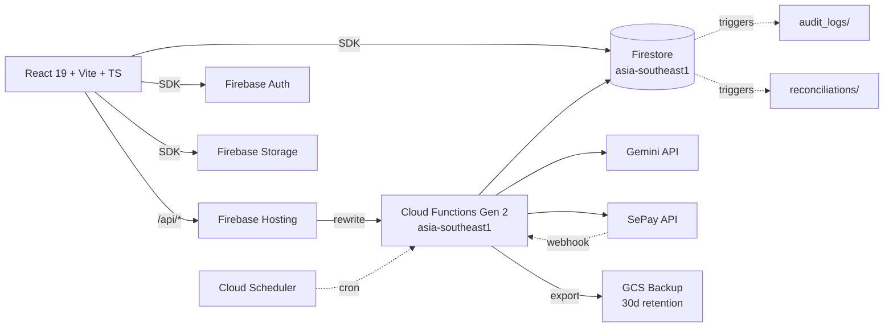

<div align="center">
  <h1>VComm ERP</h1>
  <p><strong>Hệ quản trị doanh nghiệp cho sàn TMĐT VComm Việt Nam</strong></p>

  [](https://github.com/vinhngtienmdb-ui/V-com-ERP/actions/workflows/ci.yml)
  [](https://vcomm-erp-prod.web.app)
  []()
</div>

---

## Tổng quan

VComm ERP là hệ thống ERP tích hợp cho sàn thương mại điện tử VComm. Bao phủ ~30 module nghiệp vụ:

- **Sàn TMĐT**: Quản lý đơn hàng, sản phẩm (PIM), nhà bán hàng (KYC), khách hàng (CRM), khuyến mãi
- **iPOS**: Bán hàng tại quầy với QR/cash, mở/đóng ca, báo cáo
- **eMenu**: QR menu cho khách hàng tự đặt
- **Tài chính**: Sổ cái, hóa đơn điện tử (TT 78/2021), đối soát SePay, ví seller
- **Pháp lý**: Tuân thủ NĐ 117/2025 (báo cáo thuế seller cá nhân), audit log
- **HR**: Hồ sơ nhân sự, chấm công, lương, KPI
- **AI**: Chatbot CSKH, soạn phản hồi RMA, phân tích RFM (Gemini)

## Kiến trúc



**Stack:**
- Frontend: React 19, Vite 6, TypeScript 5.8, Tailwind 4, react-router-dom 7, Sentry
- Backend: Cloud Functions Gen 2 (Node 20), Firebase Admin SDK, `@google/genai`
- Data: Firestore (default DB), Cloud Storage
- Infra: Firebase Hosting, Cloud Scheduler, Secret Manager, GitHub Actions CI/CD

## Quick start (local dev)

```sh
git clone https://github.com/vinhngtienmdb-ui/V-com-ERP.git
cd V-com-ERP
npm install
npm --prefix functions install

# Tạo .env từ template
cp .env.example .env
# Điền tối thiểu GEMINI_API_KEY (tùy chọn cho dev)

# Chạy dev server
npm run dev
# → http://localhost:3000
```

Login lần đầu: cần admin user. Xem `docs/runbook.md` section "Bootstrap admin user".

## Scripts

| Lệnh | Mô tả |
|---|---|
| `npm run dev` | Dev server với Vite middleware + Express API |
| `npm run lint` | TypeScript type-check |
| `npm test` | Vitest unit tests (~46 case) |
| `npm run build` | Build production (Vite + esbuild server) |
| `npm run fix:encoding` | Sửa mojibake nếu lỡ phát sinh |
| `npm run admin:bootstrap` | CLI set custom claim role cho user |

## Deploy

**Tự động (recommended):**

Push lên `main` → GitHub Actions deploy hosting + functions + rules. Để skip 1 commit: thêm `[skip deploy]` vào message.

**PR preview:**

Mỗi PR tự động deploy preview channel 7 ngày → bot comment URL vào PR.

**Manual:**

```sh
firebase deploy --only hosting,functions,firestore:rules --project vcomm-erp-prod
```

## Cấu trúc thư mục

```
.
├── src/
│   ├── components/        — 60+ React components (modules)
│   ├── context/           — Auth, Store, Preferences, Notification
│   ├── services/
│   │   ├── repositories/  — Repository layer + zod schemas
│   │   ├── geminiService.ts   — AI proxy
│   │   └── sepayService.ts    — Payment proxy
│   ├── lib/firebase.ts    — Firebase client init (prod/sandbox switch)
│   ├── App.tsx            — Routes + RBAC guards (lazy-loaded)
│   └── __tests__/         — Vitest
│
├── functions/             — Cloud Functions (Node 20, Gen 2)
│   └── src/               — aiHandlers, sepayHandlers, sellerHandlers,
│                            invoiceHandlers, reconciliation, auditLog,
│                            backupHandlers
│
├── scripts/               — CLI tools (bootstrap-admin, seed, fix-encoding)
├── docs/runbook.md        — Setup + sự cố thường gặp
├── infra/lifecycle.json   — GCS lifecycle rule cho backup
├── firestore.rules        — Default deny, custom claims RBAC
├── storage.rules          — Hierarchical permission
└── firebase.json          — Hosting rewrites /api/* → functions
```

## Tài liệu

- [`docs/runbook.md`](docs/runbook.md) — **Bắt buộc đọc trước khi setup prod** (chi tiết enable Storage, secrets, GCS bucket, Sentry, CI)
- [`firestore.rules`](firestore.rules) — Security model (custom claims, default deny)
- [`security_spec.md`](security_spec.md) — Threat model gốc + 12 attack scenarios

## Tuân thủ pháp lý VN

- Hóa đơn điện tử **TT 78/2021** (số tuần tự, ký hiệu K{YY}TVC, VAT 10%)
- Báo cáo thuế seller **NĐ 117/2025** (tự tổng hợp hàng tháng, 1.5% cá nhân KD TMĐT)
- Data residency `asia-southeast1` (NĐ 53/2022)
- Audit log immutable cho mọi thay đổi nhạy cảm

## Trạng thái phát triển

- ✅ Security hardening (GĐ 0)
- ✅ Repository layer + RBAC + multi-tenant (GĐ 1)
- ✅ Order/Inventory/Settlement/Seller/Invoice flow (GĐ 2.1-2.3)
- ✅ Cloud Functions + audit log + reconciliation (GĐ 1.6-1.7)
- ✅ Observability (Sentry + backup + runbook) (GĐ 4)
- ⏳ Wire UI cho 43 entity còn lại (GĐ 2.4-2.6) — đang làm theo Sprint 2-3
- ⏳ Tách monolith IPos/HR/Settings — Sprint 3

Xem chi tiết roadmap tại [`docs/runbook.md`](docs/runbook.md) và [`security_spec.md`](security_spec.md).

## License

Internal — VComm Việt Nam.
