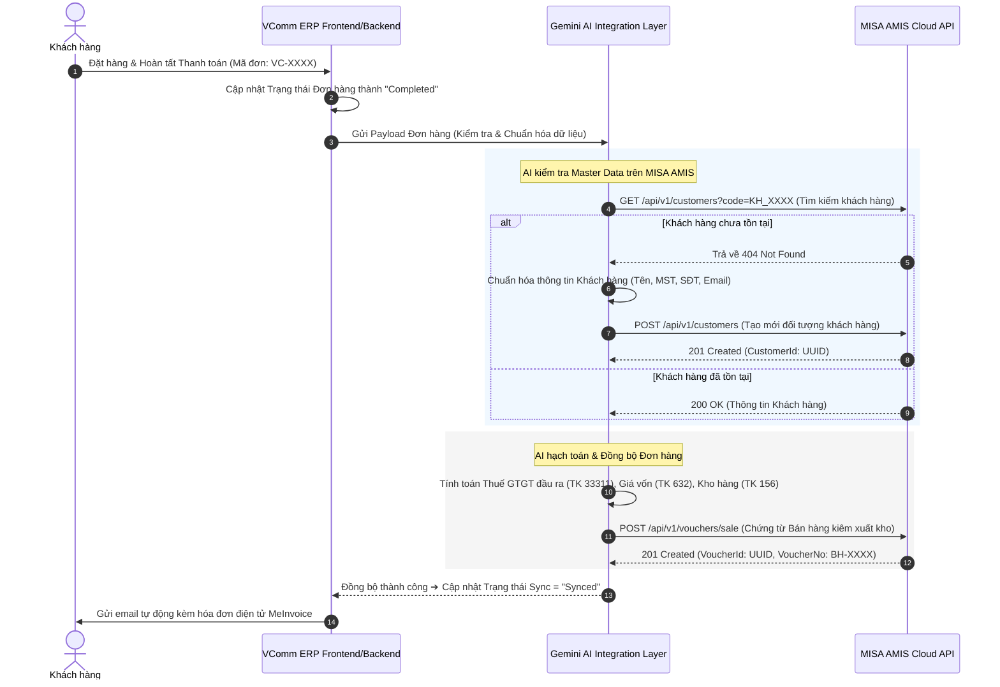
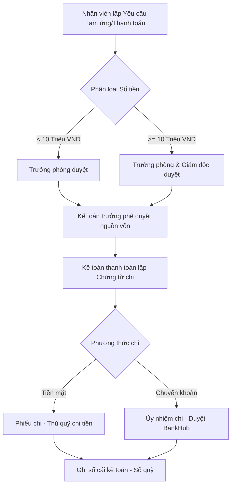
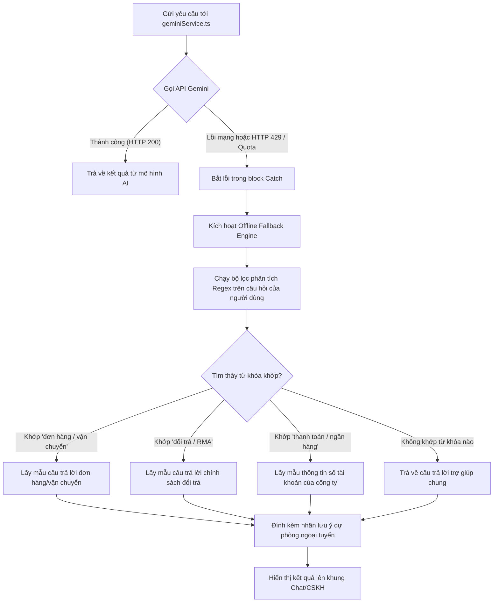

# BẢN THIẾT KẾ KỸ THUẬT VÀ BẢN ĐỒ TÍCH HỢP TỔNG THỂ (MASTER BLUEPRINT)
## HỆ THỐNG VCOMM ERP & MISA AMIS CLOUD INTEGRATION WITH GEMINI AI LAYER
*Tài liệu đặc tả chi tiết quy trình nghiệp vụ liên thông, từ điển trường dữ liệu ánh xạ, sơ đồ tuần tự API và kiến trúc xử lý của tầng trí tuệ nhân tạo*

---

## PHẦN 1: ĐẶC TẢ LUỒNG NGHIỆP VỤ & QUY TRÌNH LIÊN THÔNG

Hệ thống tích hợp giữa **VComm ERP** và **MISA AMIS** quản lý 3 quy trình liên thông cốt lõi: Bán hàng Thu tiền (Order-to-Cash), Mua hàng Thanh toán (Procure-to-Pay) và Đề nghị Thanh toán/Tạm ứng (Request-to-Payment). Dưới đây là đặc tả chi tiết từng quy trình.

---

### 1.1. Quy trình Bán hàng - Xuất kho - Thu tiền (Order-to-Cash - O2C)

#### Sơ đồ dòng chảy dữ liệu & Tương tác API (Sequence Diagram)


#### Các trạng thái của Đơn hàng và Chứng từ bán hàng (State Transitions)
1. **New (VComm ERP):** Đơn hàng mới được khởi tạo bởi khách hàng hoặc nhân viên kinh doanh.
2. **Processing (VComm ERP):** Đơn hàng đang được soạn hàng, đóng gói và bàn giao vận chuyển.
3. **Completed (VComm ERP):** Đơn hàng giao thành công, khách hàng thanh toán đầy đủ. Trạng thái này kích hoạt luồng đồng bộ sang MISA AMIS.
4. **Pending Sync (Integration Layer):** Đơn hàng được đưa vào hàng đợi đồng bộ.
5. **Sync Failed (Integration Layer):** Lỗi đồng bộ (sai mã đối tượng, sai tài khoản hạch toán, trùng số chứng từ). Giao diện hiển thị nút "Re-sync" và ghi log chi tiết lỗi.
6. **Synced (MISA AMIS):** Tạo chứng từ bán hàng kiêm xuất kho thành công. Lưu vết `MisaVoucherNo` và `MisaVoucherId` ngược lại VComm ERP.
7. **Invoiced (MISA AMIS):** Hóa đơn điện tử MeInvoice được ký số thành công và tự động gửi tới khách hàng.

#### Quy tắc Hạch toán chi tiết (Ledger Accounting Rules)
Khi đồng bộ Chứng từ bán hàng kiêm xuất kho, hệ thống tự động ghi sổ kép:
*   **Bút toán 1: Doanh thu bán hàng và Thuế đầu ra**
    *   **Nợ TK `131`** (Phải thu của khách hàng) - Chi tiết theo Mã khách hàng (`CustomerCode`).
    *   **Có TK `5111`** (Doanh thu bán hàng hóa) - Giá trị trước thuế (Tổng tiền hàng sau chiết khấu).
    *   **Có TK `33311`** (Thuế GTGT đầu ra của hàng hóa dịch vụ) - Thuế suất áp dụng (8% hoặc 10%).
*   **Bút toán 2: Giá vốn hàng bán**
    *   **Nợ TK `632`** (Giá vốn hàng bán).
    *   **Có TK `156`** (Hàng hóa) - Chi tiết theo Mã vật tư (`ItemCode`) và Mã kho (`WarehouseCode`). Giá trị xuất kho được tính theo phương pháp đã thiết lập trên AMIS (Ví dụ: Bình quân gia quyền tức thời).
*   **Bút toán 3: Thu nợ khách hàng (Nếu thanh toán ngay bằng chuyển khoản)**
    *   **Nợ TK `1121`** (Tiền gửi ngân hàng VND) - Chi tiết theo số tài khoản ngân hàng thụ hưởng.
    *   **Có TK `131`** (Phải thu của khách hàng) - Chi tiết theo Mã khách hàng (`CustomerCode`).

---

### 1.2. Quy trình Mua hàng - Nhập kho - Thanh toán (Procure-to-Pay - P2P)

#### Sơ đồ nghiệp vụ liên thông
1. **Lập Đề nghị mua hàng (Purchase Requisition):** Phòng ban có nhu cầu gửi đề xuất mua sắm vật tư, công cụ trên hệ thống.
2. **Phê duyệt Đề nghị:** Trưởng bộ phận và Giám đốc phê duyệt trực tiếp.
3. **Lập Đơn đặt mua hàng (Purchase Order - PO):** Phòng mua hàng chọn Nhà cung cấp và lập đơn mua hàng gửi đối tác.
4. **Nhập kho hàng hóa (Receiving & Inward):** Khi hàng về, thủ kho đối chiếu số lượng thực tế với PO và lập **Phiếu nhập kho**.
5. **Nhận Hóa đơn đầu vào (Vendor Bill):** Hệ thống meInvoice của MISA tự động quét, nhận hóa đơn điện tử đầu vào từ Tổng cục Thuế, đối chiếu chênh lệch số lượng và đơn giá với phiếu nhập kho.
6. **Thanh toán Nhà cung cấp (Payment):** Kế toán lập Ủy nhiệm chi (`BankPaymentVoucher`) thanh toán nợ trực tiếp qua MISA BankHub.

#### Quy tắc Hạch toán chi tiết
*   **Bút toán 1: Nhập kho hàng hóa mua ngoài**
    *   **Nợ TK `156`** (Hàng hóa) - Chi tiết theo Mã vật tư (`ItemCode`) và Mã kho (`WarehouseCode`).
    *   **Nợ TK `1331`** (Thuế GTGT được khấu trừ của hàng hóa, dịch vụ) - Theo hóa đơn đầu vào.
    *   **Có TK `331`** (Phải trả cho người bán) - Chi tiết theo Mã nhà cung cấp (`VendorCode`).
*   **Bút toán 2: Chi tiền thanh toán cho Người bán**
    *   **Nợ TK `331`** (Phải trả cho người bán) - Ghi giảm công nợ phải trả.
    *   **Có TK `1121`** (Tiền gửi ngân hàng) hoặc **Có TK `1111`** (Tiền mặt).

---

### 1.3. Quy trình Đề xuất - Phê duyệt - Thanh toán chi phí (Request-to-Payment - R2P)

#### Sơ đồ dòng chạy quy trình duyệt


#### Quy tắc Hạch toán chi tiết
*   **Bút toán 1: Chi tiền tạm ứng cho nhân viên đi công tác/mua hàng**
    *   **Nợ TK `141`** (Tạm ứng) - Chi tiết theo Mã nhân viên (`EmployeeCode`).
    *   **Có TK `1111`** (Tiền mặt) hoặc **Có TK `1121`** (Tiền gửi ngân hàng).
*   **Bút toán 2: Quyết toán tạm ứng (Khi nhân viên nộp lại hóa đơn chứng từ chi tiêu)**
    *   **Nợ TK `6422`** (Chi phí quản lý doanh nghiệp) hoặc **Nợ TK `6412`** (Chi phí bán hàng).
    *   **Nợ TK `1331`** (Thuế GTGT đầu vào nếu có hóa đơn hợp lệ).
    *   **Có TK `141`** (Tạm ứng) - Chi tiết theo Mã nhân viên để hoàn tất công nợ tạm ứng.
*   **Bút toán 3: Hoàn trả tiền tạm ứng thừa (Nếu nhân viên chi không hết tiền)**
    *   **Nợ TK `1111`** (Nhân viên nộp lại tiền mặt vào quỹ).
    *   **Có TK `141`** (Tạm ứng) - Ghi giảm số dư tạm ứng.

---

## PHẦN 2: TỪ ĐIỂN TRƯỜNG DỮ LIỆU & BẢN ĐỒ ÁNH XẠ (FIELD MAPPING)

Để đảm bảo dòng dữ liệu thông suốt không lỗi, các trường dữ liệu giữa VComm ERP và MISA AMIS được ánh xạ chi tiết theo bảng dưới đây.

### 2.1. Danh mục Khách hàng

*   **Bảng nguồn (VComm ERP):** `customers`
*   **Bảng đích (MISA AMIS):** `DICustomer`

| Tên cột VComm | Kiểu dữ liệu (VComm) | Trường đích AMIS API | Kiểu dữ liệu (AMIS) | Ràng buộc kỹ thuật | Quy tắc chuyển đổi / Regex xác thực |
| :--- | :--- | :--- | :--- | :--- | :--- |
| `id` | `INT` | `CustomerId` | `UUID` | Khóa chính (PK) | Hệ thống tích hợp tự động sinh UUID mới hoặc lưu bảng ánh xạ `VcommID <-> MisaID`. |
| `id` | `INT` | `CustomerCode` | `VARCHAR(20)` | **Bắt buộc, Duy nhất** | Chuyển đổi: `KH` + chuỗi số ID được đệm 0 (Ví dụ: `id = 145` ➔ `KH00145`). |
| `name` | `VARCHAR(255)` | `CustomerName` | `NVARCHAR(255)`| **Bắt buộc** | Loại bỏ khoảng trắng thừa ở đầu/cuối chuỗi. |
| `tax_code` | `VARCHAR(20)` | `TaxCode` | `VARCHAR(20)` | Tùy chọn | Chạy Regex kiểm tra: `^\d{10}(-\d{3})?$`. Chỉ chấp nhận 10 hoặc 13 chữ số. |
| `address` | `VARCHAR(500)` | `Address` | `NVARCHAR(500)`| Tùy chọn | Địa chỉ đăng ký xuất hóa đơn của doanh nghiệp. |
| `phone` | `VARCHAR(50)` | `Phone` | `VARCHAR(50)` | Tùy chọn | Chuẩn hóa: Loại bỏ khoảng trắng, dấu chấm, dấu gạch ngang (Ví dụ: `090.123.4567` ➔ `0901234567`). |
| `email` | `VARCHAR(100)` | `InvoiceContactEmail`| `VARCHAR(100)` | Khuyên dùng | Định dạng email nhận hóa đơn bắt buộc khớp Regex: `^[a-zA-Z0-9._%+-]+@[a-zA-Z0-9.-]+\.[a-zA-Z]{2,}$`. |
| `bank_acc` | `VARCHAR(30)` | `BankAccount` | `VARCHAR(30)` | Tùy chọn | Số tài khoản ngân hàng không chứa ký tự đặc biệt. |
| `bank_name`| `VARCHAR(100)` | `BankName` | `NVARCHAR(255)`| Tùy chọn | Tên ngân hàng chi tiết chi nhánh. |
| *(Mặc định)*| - | `CustomerType` | `INT` | Mặc định `0` | `0`: Tổ chức (Doanh nghiệp/Đại lý), `1`: Cá nhân (Khách lẻ). |
| *(Mặc định)*| - | `IsVendor` | `BOOLEAN` | Mặc định `False`| Gán bằng `False`. Nếu khách hàng đồng thời bán hàng cho công ty thì gán `True`. |

---

### 2.2. Danh mục Vật tư Hàng hóa

*   **Bảng nguồn (VComm ERP):** `products`
*   **Bảng đích (MISA AMIS):** `DIInventoryItems`

| Tên cột VComm | Kiểu dữ liệu (VComm) | Trường đích AMIS API | Kiểu dữ liệu (AMIS) | Ràng buộc kỹ thuật | Quy tắc chuyển đổi / Regex xác thực |
| :--- | :--- | :--- | :--- | :--- | :--- |
| `sku` | `VARCHAR(50)` | `ItemCode` | `VARCHAR(50)` | **Bắt buộc, Duy nhất** | Mã SKU sản phẩm của VComm hạch toán trực tiếp sang mã vật tư MISA. |
| `title` | `VARCHAR(255)` | `ItemName` | `NVARCHAR(255)`| **Bắt buộc** | Tên sản phẩm đầy đủ để in hóa đơn và phiếu kho. |
| `unit` | `VARCHAR(50)` | `BaseUnit` | `NVARCHAR(50)` | **Bắt buộc** | Chuẩn hóa sang đơn vị cơ sở trên MISA (Cái, Bộ, Thùng, Chiếc...). |
| `warehouse` | `VARCHAR(50)` | `DefaultWarehouse`| `VARCHAR(50)` | Khuyên dùng | Ánh xạ mã kho tương ứng (Ví dụ: `KHO_QUAN_9`, `KHO_LONG_AN`). |
| `account_inv`| `VARCHAR(10)` | `InventoryAccount`| `VARCHAR(20)` | **Bắt buộc** | Tài khoản kho kế toán. Phải khớp hệ thống tài khoản hoạt động (`156`, `152`, `155`). |
| `account_rev`| `VARCHAR(10)` | `RevenueAccount` | `VARCHAR(20)` | **Bắt buộc** | Tài khoản doanh thu. Mặc định `5111` (Bán hàng hóa) hoặc `5112` (Bán thành phẩm). |
| `account_cogs`| `VARCHAR(10)`| `COGSAccount` | `VARCHAR(20)` | **Bắt buộc** | Tài khoản giá vốn hàng bán. Mặc định `632`. |
| `vat_rate` | `DECIMAL` | `VATRate` | `VARCHAR(10)` | Khuyên dùng | Ánh xạ: `0` ➔ `0%`, `5` ➔ `5%`, `8` ➔ `8%`, `10` ➔ `10%`, `-1` ➔ `KCT` (Không chịu thuế). |
| *(Mặc định)*| - | `ItemProperty` | `INT` | Mặc định `0` | Tính chất sản phẩm: `0`: Vật tư hàng hóa, `1`: Dịch vụ, `2`: Nguyên vật liệu. |

---

### 2.3. Thực thể Chứng từ Bán hàng kiêm Xuất kho

*   **Bảng nguồn (VComm ERP):** `orders` & `order_items`
*   **Bảng đích (MISA AMIS):** `SaleVoucher` & `SaleVoucherDetails`

| Thực thể nguồn | Tên cột VComm | Trường đích AMIS | Kiểu dữ liệu (AMIS) | Ràng buộc | Quy tắc chuyển đổi / Nghiệp vụ |
| :--- | :--- | :--- | :--- | :--- | :--- |
| **Header** | `order_id` | `VoucherNo` | `VARCHAR(50)` | **Bắt buộc, Duy nhất**| Số chứng từ bán hàng. Định dạng: `BH-2026-` + chuỗi số tăng dần của VComm. |
| **Header** | `created_at` | `VoucherDate` | `DATE` | **Bắt buộc** | Ngày lập chứng từ. Chuyển đổi định dạng: `YYYY-MM-DD`. |
| **Header** | `created_at` | `GLDate` | `DATE` | **Bắt buộc** | Ngày ghi sổ kế toán. Trùng `VoucherDate` trừ khi khóa sổ kỳ kế toán. |
| **Header** | `customer_id`| `CustomerCode` | `VARCHAR(20)` | **Bắt buộc** | Mã khách hàng hạch toán. Phải tồn tại trong danh mục `DICustomer`. |
| **Header** | `pay_method` | `PaymentMethod` | `VARCHAR(10)` | **Bắt buộc** | Ánh xạ: `Cash` ➔ `0` (Tiền mặt), `BankTransfer` ➔ `1` (Chuyển khoản). |
| **Header** | `subtotal` | `TotalAmount` | `DECIMAL(18,2)`| **Bắt buộc** | Tổng giá trị hàng hóa trước thuế và chiết khấu. |
| **Header** | `vat_total` | `TotalVATAmount` | `DECIMAL(18,2)`| **Bắt buộc** | Tổng tiền thuế giá trị gia tăng đầu ra của đơn hàng. |
| **Detail** | `sku` | `ItemCode` | `VARCHAR(50)` | **Bắt buộc** | Mã hàng xuất kho. Phải tồn tại trong `DIInventoryItems`. |
| **Detail** | `qty` | `Quantity` | `DECIMAL(18,4)`| **Bắt buộc, > 0** | Số lượng xuất bán sản phẩm thực tế. |
| **Detail** | `price` | `UnitPrice` | `DECIMAL(18,4)`| **Bắt buộc** | Đơn giá bán chưa bao gồm thuế GTGT. |
| **Detail** | `amount` | `Amount` | `DECIMAL(18,2)`| **Bắt buộc** | Thành tiền chưa thuế = `Quantity` * `UnitPrice`. |
| **Detail** | `vat_rate` | `VATRate` | `VARCHAR(10)` | **Bắt buộc** | Thuế suất sản phẩm (`8%`, `10%`...). |
| **Detail** | `vat_amount`| `VATAmount` | `DECIMAL(18,2)`| **Bắt buộc** | Tiền thuế GTGT cho dòng sản phẩm = `Amount` * `VATRate`. |
| **Detail** | - | `DebitAccount` | `VARCHAR(20)` | **Bắt buộc** | Mặc định `131` (nếu thanh toán sau) hoặc `1121`/`1111` (nếu thanh toán ngay). |
| **Detail** | - | `CreditAccount`| `VARCHAR(20)` | **Bắt buộc** | Mặc định `5111` (Doanh thu bán hàng hóa). |
| **Detail** | - | `WarehouseCode`| `VARCHAR(50)` | **Bắt buộc** | Mã kho thực tế lấy hàng. |
| **Detail** | - | `InventoryAccount`| `VARCHAR(20)`| **Bắt buộc** | Mặc định `156` (Hàng hóa kho). |
| **Detail** | - | `COGSAccount` | `VARCHAR(20)` | **Bắt buộc** | Mặc định `632` (Giá vốn hàng bán). |

---

## PHẦN 3: ĐẶC TẢ KỸ THUẬT API TÍCH HỢP (REST API CONTRACTS)

### 3.1. API POST /api/v1/customers (Đăng ký khách hàng mới)
Hệ thống VComm gọi endpoint này khi phát hiện thông tin khách hàng mới trong đơn hàng cần đồng bộ.

#### Request Payload (JSON)
```json
{
  "CustomerType": 0,
  "CustomerCode": "KH00145",
  "CustomerName": "Công ty TNHH Lucky Shopping Việt Nam",
  "TaxCode": "0316789123",
  "Address": "Tầng 12, Tòa nhà Landmark 81, Phường 22, Quận Bình Thạnh, TP. Hồ Chí Minh",
  "Phone": "02873006888",
  "InvoiceContactEmail": "finance@luckyshopping.vn",
  "IsVendor": false,
  "CreditLimit": 200000000.00,
  "DueDays": 15,
  "BankAccount": "19034567890123",
  "BankName": "Ngân hàng Techcombank - Chi nhánh Sài Gòn"
}
```

#### Response Payload (201 Created)
```json
{
  "Success": true,
  "CustomerId": "e9a7e089-a299-4df1-bd90-1c09ab022134",
  "CustomerCode": "KH00145",
  "Message": "Khách hàng 'Công ty TNHH Lucky Shopping Việt Nam' đã được khởi tạo thành công trên hệ thống MISA AMIS."
}
```

#### Response Payload (400 Bad Request - Trùng mã đối tượng)
```json
{
  "Success": false,
  "ErrorCode": "DUPLICATE_CUSTOMER_CODE",
  "Message": "Không thể tạo đối tượng khách hàng.",
  "Errors": [
    {
      "Field": "CustomerCode",
      "Reason": "Mã khách hàng 'KH00145' đã tồn tại trong danh mục."
    }
  ]
}
```

---

### 3.2. API POST /api/v1/vouchers/sale (Hạch toán Chứng từ Bán hàng kiêm Xuất kho)
Hệ thống gọi API này sau khi đã xác thực và đảm bảo Master Data (Khách hàng & Hàng hóa) đã tồn tại đầy đủ trên MISA AMIS.

#### Request Payload (JSON)
```json
{
  "VoucherType": "SaleVoucher",
  "VoucherNo": "BH-2026-00982",
  "VoucherDate": "2026-06-03",
  "GLDate": "2026-06-03",
  "CustomerCode": "KH00145",
  "CustomerName": "Công ty TNHH Lucky Shopping Việt Nam",
  "TaxCode": "0316789123",
  "Address": "Tầng 12, Tòa nhà Landmark 81, Phường 22, Quận Bình Thạnh, TP. Hồ Chí Minh",
  "PaymentMethod": "1",
  "TotalAmount": 27272728,
  "TotalVATAmount": 2727272,
  "Details": [
    {
      "ItemCode": "VT00085",
      "ItemName": "Bộ định tuyến Switch Cisco Catalyst C1000-24T-4G-L",
      "Unit": "Bộ",
      "Quantity": 2,
      "UnitPrice": 13636364,
      "Amount": 27272728,
      "VATRate": "10%",
      "VATAmount": 2727272,
      "DebitAccount": "1121",
      "CreditAccount": "5111",
      "WarehouseCode": "KHO_HA_NOI",
      "InventoryAccount": "156",
      "COGSAccount": "632"
    }
  ]
}
```

#### Response Payload (201 Created)
```json
{
  "Success": true,
  "VoucherId": "8fa8d390-349c-4621-a1b0-2b10df04acb2",
  "VoucherNo": "BH-2026-00982",
  "Message": "Hạch toán chứng từ bán hàng kiêm xuất kho thành công. Hóa đơn đã sẵn sàng phát hành.",
  "FinancialImpact": {
    "DebitSum": 30000000,
    "CreditSum": 30000000,
    "LedgerRecorded": true
  }
}
```

#### Response Payload (422 Unprocessable Entity - Sai tài khoản hạch toán)
```json
{
  "Success": false,
  "ErrorCode": "INVALID_ACCOUNTING_ENTRY",
  "Message": "Hạch toán chứng từ thất bại do sai quy định tài khoản.",
  "Errors": [
    {
      "Field": "Details[0].InventoryAccount",
      "Reason": "Tài khoản '156' là tài khoản tổng hợp cấp 1. Bạn bắt buộc phải chọn tài khoản chi tiết cấp 2 ('1561' hoặc '1562') theo thiết lập hệ thống tài khoản hiện hành."
    }
  ]
}
```

---

## PHẦN 4: THIẾT KẾ KỸ THUẬT TẦNG AI (GEMINI AI INTEGRATION)

Tầng AI Layer trong VComm ERP sử dụng **Gemini 3.5 Flash** để thực hiện các nghiệp vụ tự động hóa và phân tích dữ liệu thông qua cấu hình prompt chính xác và định dạng dữ liệu đầu ra có cấu trúc (Structured Outputs JSON).

### 4.1. Đặc tả Prompt & Cấu trúc Dữ liệu JSON (Structured Schema)

#### A. Soạn phản hồi RMA Tự động (Đổi trả hàng lỗi)
Khi khách hàng gửi yêu cầu đổi trả, hệ thống gửi cấu trúc dữ liệu đơn hàng và lý do lỗi cho Gemini để soạn thảo thư phản hồi chuẩn.

*   **Prompt mẫu (System Instruction & User Message):**
    ```text
    [SYSTEM INSTRUCTION]
    Bạn là trợ lý ảo CSKH cấp cao của VComm ERP. Nhiệm vụ của bạn là đọc thông tin yêu cầu RMA (đổi trả sản phẩm lỗi) của khách hàng và tự động soạn thảo một phản hồi xin lỗi lịch sự, nêu hướng xử lý đổi mới hoặc hoàn tiền theo quy định và hướng dẫn các bước tiếp theo.
    
    Yêu cầu định dạng đầu ra phải là một đối tượng JSON hợp lệ duy nhất khớp chính xác với JSON Schema được cung cấp, không chứa bất kỳ markdown hay văn bản thừa nào bên ngoài khối JSON.

    [USER MESSAGE]
    Thông tin yêu cầu RMA:
    - Mã đơn hàng: VC-2026-8801
    - Tên khách hàng: Nguyễn Văn A
    - Sản phẩm đổi trả: Tai nghe chống ồn Sony WH-1000XM4 (Mã: SP0093)
    - Số lượng: 1
    - Lý do khách báo: Tai nghe bên trái không lên nguồn, cắm sạc không báo đèn đỏ. Đã thử đổi cáp sạc khác nhưng không khắc phục được.
    - Thời hạn mua hàng: Cách đây 3 ngày (Trong diện hỗ trợ đổi mới 1-đổi-1 trong vòng 7 ngày).
    - Phương thức mong muốn: Đổi sang sản phẩm mới cùng loại.
    ```

*   **JSON Schema Đầu ra yêu cầu (Output Structured Schema):**
    ```json
    {
      "type": "object",
      "properties": {
        "emailSubject": {
          "type": "string",
          "description": "Tiêu đề email phản hồi RMA"
        },
        "emailBody": {
          "type": "string",
          "description": "Nội dung chi tiết thư phản hồi viết bằng tiếng Việt lịch sự, công sở"
        },
        "approvalStatus": {
          "type": "string",
          "enum": ["APPROVED_FOR_REPLACEMENT", "APPROVED_FOR_REFUND", "PENDING_INSPECTION", "REJECTED"],
          "description": "Trạng thái đề xuất duyệt xử lý của AI dựa trên quy định đổi trả"
        },
        "nextSteps": {
          "type": "array",
          "items": {
            "type": "string"
          },
          "description": "Các bước tiếp theo khách hàng cần làm (Đóng gói hàng, gửi về địa chỉ bảo hành...)"
        }
      },
      "required": ["emailSubject", "emailBody", "approvalStatus", "nextSteps"]
    }
    ```

*   **Kết quả đầu ra thực tế từ Gemini AI:**
    ```json
    {
      "emailSubject": "[VComm ERP] Xác nhận tiếp nhận và xử lý yêu cầu đổi trả đơn hàng VC-2026-8801",
      "emailBody": "Kính gửi Quý khách Nguyễn Văn A,\n\nLời đầu tiên, VComm xin chân thành xin lỗi Quý khách về sự cố kỹ thuật xảy ra đối với sản phẩm Tai nghe chống ồn Sony WH-1000XM4 thuộc đơn hàng VC-2026-8801.\n\nĐối chiếu theo quy định đổi trả sản phẩm, đơn hàng của Quý khách được mua cách đây 3 ngày, hoàn toàn nằm trong chính sách hỗ trợ đổi mới 1-đổi-1 trong vòng 7 ngày đối với các lỗi từ nhà sản xuất. Bộ phận CSKH của chúng tôi đã phê duyệt yêu cầu đổi mới sản phẩm của Quý khách.\n\nChúng tôi sẽ tạo một đơn hàng đổi trả mới và vận chuyển sản phẩm tai nghe Sony WH-1000XM4 hoàn toàn mới đến địa chỉ của Quý khách. Khi nhân viên giao hàng đến, Quý khách vui lòng bàn giao lại sản phẩm lỗi (bao gồm đầy đủ hộp và phụ kiện đi kèm) cho nhân viên giao nhận.\n\nMọi chi phí vận chuyển phát sinh sẽ do VComm chi trả. Nếu có thêm bất kỳ câu hỏi nào, xin Quý khách vui lòng liên hệ hotline 1900-XXXX.\n\nTrân trọng cảm ơn sự thông cảm của Quý khách,\nĐội ngũ CSKH VComm ERP.",
      "approvalStatus": "APPROVED_FOR_REPLACEMENT",
      "nextSteps": [
        "Đóng gói sản phẩm lỗi vào hộp gốc kèm đầy đủ phụ kiện cáp sạc.",
        "Chờ nhân viên giao vận mang sản phẩm mới đến trao đổi trực tiếp tại nhà.",
        "Bàn giao sản phẩm lỗi và ký xác nhận biên bản đổi hàng."
      ]
    }
    ```

---

#### B. Phân tích Dòng tiền CFO & Khuyến nghị Tài chính
AI đọc số liệu dòng tiền từ AMIS Kế toán gửi lên để xuất bản báo cáo phân tích tài chính thông minh cho Ban Giám đốc.

*   **Prompt mẫu (System Instruction & User Message):**
    ```text
    [SYSTEM INSTRUCTION]
    Bạn là Giám đốc Tài chính (CFO) ảo tích hợp trong VComm ERP. Hãy phân tích báo cáo dòng tiền thực tế được gửi tới dưới dạng JSON. Đưa ra nhận xét cụ thể về xu hướng dòng tiền, cảnh báo rủi ro về thanh khoản nếu dòng tiền ròng âm, và đề xuất 3 khuyến nghị hành động tối ưu hóa ngân sách tài chính ngắn hạn.
    
    [USER MESSAGE]
    Dữ liệu dòng tiền kỳ hoạt động tháng 5/2026:
    {
      "CashInflow": 1250000000,
      "CashOutflow": 1420000000,
      "NetCashFlow": -170000000,
      "AccountsReceivable": 450000000,
      "AccountsPayable": 280000000,
      "CurrentCashBalance": 180000000
    }
    ```

*   **JSON Schema Đầu ra yêu cầu:**
    ```json
    {
      "type": "object",
      "properties": {
        "analysisSummary": {
          "type": "string",
          "description": "Nhận xét tổng quan về dòng tiền tháng"
        },
        "riskLevel": {
          "type": "string",
          "enum": ["LOW", "MEDIUM", "HIGH", "CRITICAL"],
          "description": "Mức độ rủi ro thanh khoản của doanh nghiệp"
        },
        "riskWarning": {
          "type": "string",
          "description": "Lời cảnh báo cụ thể về rủi ro (nếu có)"
        },
        "recommendations": {
          "type": "array",
          "items": {
            "type": "string"
          },
          "description": "3 khuyến nghị tài chính chi tiết để cải thiện dòng tiền"
        }
      },
      "required": ["analysisSummary", "riskLevel", "riskWarning", "recommendations"]
    }
    ```

*   **Kết quả đầu ra thực tế từ Gemini AI:**
    ```json
    {
      "analysisSummary": "Trong tháng 5/2026, dòng tiền ròng của doanh nghiệp ghi nhận mức âm 170.000.000 VND do tổng chi (1,42 tỷ VND) vượt quá tổng thu (1,25 tỷ VND). Mặc dù doanh nghiệp vẫn còn khoản phải thu khách hàng lớn (450.000.000 VND), tuy nhiên số dư tiền mặt hiện tại chỉ còn 180.000.000 VND, chỉ đủ trang trải chi phí hoạt động cho khoảng 4 ngày tới nếu không có dòng tiền thu hồi mới.",
      "riskLevel": "HIGH",
      "riskWarning": "Doanh nghiệp đối mặt với rủi ro mất cân đối thanh khoản nghiêm trọng trong ngắn hạn do số dư tiền mặt dự trữ (180 triệu VND) thấp hơn nhiều so với công nợ phải trả đến hạn (280 triệu VND) và xu hướng dòng tiền ròng đang âm.",
      "recommendations": [
        "Quyết liệt đôn đốc thu hồi nợ: Tập trung thu hồi sớm 450 triệu VND khoản phải thu từ khách hàng, đặc biệt là các khoản nợ quá hạn bằng cách áp dụng chiết khấu thanh toán nhanh 1-2%.",
        "Đàm phán giãn nợ nhà cung cấp: Liên hệ thương thảo với các nhà cung cấp lớn để kéo dài thời hạn thanh toán các khoản phải trả (280 triệu VND) từ 15 ngày lên 30-45 ngày.",
        "Cắt giảm chi tiêu không cấp thiết: Tạm hoãn các khoản chi mua sắm tài sản cố định hoặc đầu tư công cụ mới trong tháng 6 cho đến khi dòng tiền ròng dương trở lại."
      ]
    }
    ```

---

### 4.2. Cơ chế Xử lý Lỗi & Dự phòng Ngoại tuyến (Offline Fallback Mode)

Khi gặp lỗi mất kết nối Internet hoặc lỗi quá hạn mức cuộc gọi API của Google (Rate limit `HTTP 429`), hệ thống sẽ tự động kích hoạt **Offline Fallback Engine** chạy trực tiếp tại Client Browser nhằm đảm bảo nghiệp vụ không bị gián đoạn.

#### Sơ đồ logic hoạt động của Offline Fallback


#### Quy tắc Phân tích từ khóa (Regex Rule Matcher) & Phản hồi mẫu
Dưới đây là bảng định nghĩa các mẫu biểu thức chính quy (Regex) và câu trả lời mô phỏng được lập trình sẵn trong file [geminiService.ts](file:///C:/Users/VINHNT/.gemini/antigravity/scratch/V-com-ERP/src/services/geminiService.ts):

| STT | Mẫu Regex kiểm tra (Không phân biệt chữ hoa/thường) | Từ khóa đích | Nội dung phản hồi dự phòng ngoại tuyến (Simulated Response) |
| :--- | :--- | :--- | :--- |
| 1 | `(đơn hàng\|don hang\|mã đơn\|ma don\|tra cứu đơn)` | Đơn đặt hàng | "Hệ thống ngoại tuyến: Để tra cứu trạng thái đơn hàng nhanh nhất, vui lòng truy cập trực tiếp vào phân hệ **[Đơn hàng](file:///C:/Users/VINHNT/.gemini/antigravity/scratch/V-com-ERP/src/components/Orders.tsx)** trên thanh Sidebar và nhập mã đơn hàng của bạn vào thanh tìm kiếm." |
| 2 | `(đổi trả\|đổi hàng\|trả hàng\|lỗi sản phẩm\|hỏng\|rma)` | Đổi trả hàng | "Hệ thống ngoại tuyến: Chính sách đổi trả của công ty quy định: Hỗ trợ 1-đổi-1 cho sản phẩm lỗi phần cứng từ nhà sản xuất trong vòng 7 ngày kể từ ngày giao hàng. Quý khách vui lòng đóng gói sản phẩm kèm hộp nguyên bản và gửi về trung tâm bảo hành gần nhất." |
| 3 | `(thanh toán\|chuyển khoản\|tài khoản ngân hàng\|stk)` | Ngân hàng | "Hệ thống ngoại tuyến: Quý khách có thể chuyển khoản thanh toán đơn hàng theo thông tin sau:\n- Ngân hàng: Techcombank\n- Số tài khoản: 19034567890123\n- Chủ tài khoản: CONG TY TNHH LUCKY SHOPPING VIET NAM\n- Nội dung chuyển khoản: [Mã đơn hàng VComm]." |
| 4 | `(vận chuyển\|giao hàng\|ship\|bao lâu\|nhận hàng)` | Vận chuyển | "Hệ thống ngoại tuyến: Thời gian giao hàng tiêu chuẩn:\n- Nội thành Hà Nội/TP.HCM: 1-2 ngày làm việc.\n- Các tỉnh thành khác: 3-5 ngày làm việc. Quý khách có thể tra cứu hành trình trực tiếp bằng mã vận đơn trên cổng thông tin GHN hoặc GHTK." |
| 5 | *Mặc định (Không khớp mẫu nào)* | Hỗ trợ chung | "Hệ thống ngoại tuyến: Xin lỗi, hiện tại kết nối tới máy chủ AI thông minh đang tạm thời bị gián đoạn hoặc vượt quá giới hạn lượt truy vấn. Tôi có thể giúp gì cho bạn về các quy trình tra cứu đơn hàng, đổi trả sản phẩm lỗi hoặc thông tin chuyển khoản ngân hàng?" |

> [!NOTE]
> Tất cả các phản hồi được xuất ra từ chế độ Offline Fallback sẽ tự động được đính kèm dòng thông báo ở cuối:
> `*(Lưu ý: Hệ thống đang vận hành ở chế độ dự phòng ngoại tuyến cục bộ do kết nối dịch vụ AI đám mây đạt ngưỡng giới hạn)*`.

---

## PHẦN 5: KIỂM SOÁT LỖI TÍCH HỢP & QUY TẮC PHỐI HỢP DỮ LIỆU

Nhằm mục đích bảo vệ tính toàn vẹn của dữ liệu kế toán tài chính trên MISA AMIS, hệ thống tích hợp bắt buộc phải thực thi 3 cổng xác thực tự động (Validation Gates) trước khi truyền dữ liệu qua API:

### 5.1. Cổng xác thực tính toàn vẹn Danh mục gốc (Master Integrity Gate)
*   **Mục tiêu:** Tránh lỗi mồ côi liên kết dữ liệu (Orphaned references) gây lỗi nghiêm trọng trên cơ sở dữ liệu của AMIS.
*   **Logic xử lý:**
    ```typescript
    async function validateVoucherBeforeSync(voucher: any): Promise<boolean> {
      // 1. Kiểm tra sự tồn tại của Khách hàng
      const customerExists = await checkCustomerOnMisa(voucher.CustomerCode);
      if (!customerExists) {
        throw new Error(`Đồng bộ thất bại: Khách hàng với mã '${voucher.CustomerCode}' chưa được khai báo danh mục gốc trên MISA AMIS.`);
      }
      
      // 2. Kiểm tra sự tồn tại của từng Vật tư hàng hóa trong Details
      for (const item of voucher.Details) {
        const itemExists = await checkInventoryItemOnMisa(item.ItemCode);
        if (!itemExists) {
          throw new Error(`Đồng bộ thất bại: Vật tư hàng hóa mã '${item.ItemCode}' chưa được đăng ký trong danh mục trên MISA AMIS.`);
        }
      }
      return true;
    }
    ```

### 5.2. Cổng xác thực hạch toán tài khoản kế toán (Accounting Verification Gate)
*   **Quy tắc tài khoản tổng hợp:** Không bao giờ cho phép hạch toán trực tiếp vào các tài khoản tổng hợp cấp 1 nếu tài khoản đó đã được phân rã chi tiết thành các tài khoản cấp con.
    *   *Ví dụ:* Trên MISA AMIS có thiết lập:
        *   `156` - Hàng hóa (Tài khoản cha - Tổng hợp).
        *   `1561` - Giá mua hàng hóa (Tài khoản con - Chi tiết).
        *   `1562` - Chi phí mua hàng (Tài khoản con - Chi tiết).
    *   ➔ Hệ thống tích hợp bắt buộc phải hạch toán trường `InventoryAccount` vào `1561` hoặc `1562`. Nếu truyền giá trị `156`, API của MISA sẽ trả về lỗi `HTTP 422 Unprocessable Entity`.
*   **Quy tắc kiểm tra đối chiếu số dư sổ cái (Double-Entry Balance Check):**
    *   Trước khi phát lệnh POST, hệ thống chạy hàm cộng tổng kiểm tra chéo:
        $$\sum \text{DebitAmount} = \sum \text{CreditAmount}$$
    *   Nếu phát hiện chênh lệch dù chỉ 1 đồng VND (do sai số làm tròn số thập phân khi tính thuế), hệ thống phải tự động điều chỉnh số tiền thuế hoặc giá trị dòng cuối cùng để đảm bảo cân bằng tuyệt đối trước khi truyền qua API.
