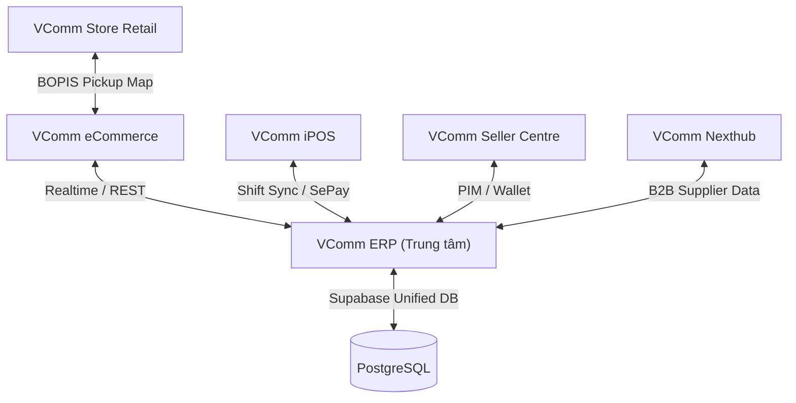

# Nhật ký dự án VComm

- Dự án: VComm
- Ngày bắt đầu: 2026-10-05
- Ngày cập nhật gần nhất: 2026-10-05
- Phạm vi: toàn bộ hệ sinh thái VComm (ERP, eCommerce, iPOS, Seller Centre, Store Retail, Nexthub, hạ tầng CSDL trung tâm)

> **Tệp này là nguồn duy nhất** ghi lịch sử của dự án VComm, gồm hai phần.
>
> - **Phần I — Nhật ký phát hành hệ sinh thái:** các đợt phát hành theo chuẩn Semantic Versioning (v1.0.0 đến v2.3.0).
> - **Phần II — Nhật ký công việc theo ngày:** công việc hằng ngày của dự án.
>
> Lịch sử hợp nhất: ngày 2026-10-05 gộp và xóa `CHANGELOG.md` (trùng lặp hoàn toàn); cùng ngày gộp `NHAT_KY_CAP_NHAT.md` ở thư mục gốc dự án vào tệp này và xóa.

## Quy ước ghi nhật ký

- Chỉ ghi thêm, không ghi đè.
- Mỗi mục ghi rõ ngày, người thực hiện, nội dung, tệp bị ảnh hưởng, kết quả kiểm thử.
- Không ghi thông tin tạm thời như kết quả tra cứu, đường dẫn tạm, thông báo lỗi của công cụ.

---

## Phần I — Nhật ký phát hành hệ sinh thái

*VComm Ecosystem Master Changelog & Update History*

> **Tài liệu theo dõi lịch sử phát triển, nâng cấp kỹ thuật và nhật ký thay đổi phiên bản của toàn bộ hệ sinh thái phần mềm VComm (Bao gồm ERP, eCommerce, iPOS, Seller Centre, Store Retail, Nexthub và Hạ tầng CSDL Trung tâm).**

---

### 🗺️ TỔNG QUAN CÁC PHÂN HỆ TRONG HỆ SINH THÁI

Hệ sinh thái **VComm** được xây dựng theo mô hình **Omnichannel & O2O (Online-to-Offline)** hoàn chỉnh, kết nối liền mạch giữa bán lẻ trực tiếp, sàn thương mại điện tử, kênh nhà bán hàng, đối tác B2B và trung tâm điều hành ERP:

| STT | Phân hệ | Thư mục | Vai trò cốt lõi & Công nghệ | Cổng mặc định |
|:---:|:---|:---|:---|:---:|
| **1** | **VComm ERP** | `vcomm-erp` | Trung tâm điều hành doanh nghiệp, Kế toán kép MISA, PIM phê duyệt sản phẩm, Chữ ký số RSA, Quản trị kho đa chi nhánh, AI Copilot & RAG SQL | `3000` |
| **2** | **VComm eCommerce** | `vcomm-ecommerce` | Sàn TMĐT đa kênh B2C/B2B, trải nghiệm mua sắm, nhận hàng tại cửa hàng (BOPIS), Vòng quay may mắn, Mua chung, Ví người dùng & V-Xu | `5173` |
| **3** | **VComm iPOS** | `vcomm-ipos` | Máy POS bán lẻ tại quầy, kiến trúc Offline-First (IndexedDB), in hóa đơn nhiệt LAN K80/K57, hóa đơn điện tử MeInvoice HSM VAT, quản lý ca làm việc | `3002` |
| **4** | **VComm Seller Centre** | `vcomm-seller` | Cổng thông tin dành cho Nhà bán hàng (Seller Portal), quản lý đơn, doanh thu, ví số dư, nhân viên gian hàng và xử lý yêu cầu hóa đơn VAT | `3004` |
| **5** | **VComm Store Retail** | `vcomm-store-retail` | Mạng lưới điểm bán lẻ & Bản đồ định vị chi nhánh, hỗ trợ tra cứu tồn kho thực tế và chọn điểm nhận hàng theo vị trí địa lý | `3003` |
| **6** | **VComm Nexthub** | `vcomm-nexthub` | Nền tảng B2B kết nối nhà cung cấp, chuẩn hóa danh mục sản phẩm và đồng bộ dữ liệu tham chiếu đa kênh | `3005` |
| **7** | **Central DB & Cloud** | Root SQL / Cloud | Supabase PostgreSQL, Row Level Security (RLS), Database Triggers realtime, Vercel Serverless API Proxy, SePay Webhook Gateway | Cloud |

---

### 📌 QUY ƯỚC QUẢN LÝ PHIÊN BẢN
Dự án tuân thủ theo chuẩn **Semantic Versioning 2.0.0** (`MAJOR.MINOR.PATCH`):
- **MAJOR**: Các đợt đại tu cấu trúc kiến trúc liên phân hệ (Phases Ecosystem Upgrades).
- **MINOR**: Bổ sung phân hệ mới, tính năng nghiệp vụ lớn hoặc nâng cấp giao diện toàn diện.
- **PATCH**: Sửa lỗi đồng bộ dữ liệu, vá bảo mật, tối ưu hiệu năng và điều chỉnh layout.

---

### 📑 MỤC LỤC PHIÊN BẢN
- [v2.3.0 (17/09/2026) – Chuyển Đổi Core Backend Độc Lập (NestJS) & Làm Sạch V-ERP Thuần Vite](#v230---2026-09-17)
- [v2.2.0 (23/06/2026) – Đồng bộ Realtime Supabase, Nâng cấp Vercel Proxy & Hoàn thiện Hệ thống Ví](#v220---2026-06-23)
- [v2.1.0 (20/06/2026) – Ra mắt Kênh Người Bán (Seller Centre), Chuẩn hóa Địa chỉ 2 Cấp & Phân quyền RBAC](#v210---2026-06-20)
- [v2.0.0 (19/06/2026) – Đại Bản Phát Hành Hợp Nhất Toàn Bộ Hệ Sinh Thái VComm (Phases 1–6)](#v200---2026-06-19)
- [v1.5.0 (12/06/2026 – 13/06/2026) – Đột phá iPOS Offline-First, Chữ ký số RSA & Cơ sở Dữ liệu Quan hệ](#v150---2026-06-12--2026-06-13)
- [v1.4.0 (09/06/2026 – 11/06/2026) – Mở rộng Đa Phân hệ Độc lập: Tách iPOS, Khởi tạo Store Retail & Nexthub B2B](#v140---2026-06-09--2026-06-11)
- [v1.3.0 (11/05/2026 – 20/05/2026) – Tái Thiết Kế Giao diện UI/UX Hệ thống, Tối ưu Hiệu năng & Ký số](#v130---2026-05-11--2026-05-20)
- [v1.2.0 (06/05/2026 – 07/05/2026) – Khởi tạo Sàn Thương mại Điện tử VComm eCommerce](#v120---2026-05-06--2026-05-07)
- [v1.1.0 (20/04/2026 – 29/04/2026) – Mở rộng Nghiệp vụ V-ERP: Tích hợp SePay, Trợ lý Gemini AI & iPOS v1](#v110---2026-04-20--2026-04-29)
- [v1.0.0 (18/04/2026) – Khởi Tạo Dự Án Trung Tâm Quản Trị Doanh Nghiệp VComm ERP](#v100---2026-04-18)

---

### 🚀 CHI TIẾT CÁC ĐỢT CẬP NHẬT

#### [v2.3.0] - 2026-09-17
#### 🚀 Chuyển Đổi Sang Core Backend Độc Lập (NestJS) & "Làm Sạch 1 Lần" V-ERP Thành Vite Thuần

Đợt cập nhật mang tính bước ngoặt kiến trúc: Tách rời hoàn toàn máy chủ Express nguyên khối cũ trong `vcomm-erp` (Phương án B: Làm sạch 1 lần), kích hoạt máy chủ API trung tâm độc lập `vcomm-core-backend` (NestJS - Port 5000), đồng bộ 100% các phân hệ O2O và vượt qua bộ kiểm thử tích hợp 10/10 test cases.

#### 🏢 1. VComm Core Backend (`vcomm-core-backend` - Port 5000)
- **Kiến trúc NestJS Enterprise**: Thiết lập dịch vụ backend tập trung với cấu trúc Module, Controller, Service chuẩn hóa.
- **GatewayModule Đa Kênh**: Bổ sung phân hệ cổng Gateway xử lý cấu hình địa giới 2 cấp, liên thông 3PL GHN/GHTK, sinh mã Dynamic VietQR NAPAS247, hoàn tiền ví V-Xu và cung cấp API tương thích cho iPOS & Seller Portal.
- **Transparent URL Rewrite**: Bổ sung middleware tự động chuyển đổi các yêu cầu từ `/api/*` cũ sang `/api/v1/*`, đảm bảo tương thích ngược 100% không làm gián đoạn các client vệ tinh.
- **Kiểm thử tự động**: Xây dựng kịch bản `test_master_integration.js` kiểm tra 10/10 luồng API trọng yếu và đạt tỷ lệ thành công 100%.

#### 💼 2. VComm ERP (`vcomm-erp` - Port 3000)
- **Tách khỏi Monolith Express**: Chuyển đổi hoàn toàn sang Single Page Application (Vite thuần).
- **Cấu hình Reverse Proxy**: Thiết lập Vite dev proxy chuyển tiếp toàn bộ request `/api` sang Core Backend cổng 5000.
- **Tối ưu hóa Build**: Thời gian build production hoàn tất trong 15.62s (3.126 modules), sẵn sàng triển khai tĩnh lên Vercel/Netlify.

#### 🛒 3. 5 Phân Hệ Vệ Tinh (eCommerce, iPOS, Seller, Store Retail, Nexthub)
- **vcomm-ecommerce (Port 5173)**: Cập nhật server API và proxy chuyển tiếp đơn hàng, tra cứu tồn kho sang cổng 5000.
- **vcomm-ipos (Port 3002)**: Chuẩn hóa URL ERP mặc định trong `erpApiService.ts`, `AuthContext.tsx`, `LoginPage.tsx`, `IPosSettings.tsx` sang cổng 5000.
- **vcomm-seller (Port 3004)**: Cập nhật proxy `vite.config.ts`, `server.ts` và endpoint vector search sang cổng 5000.
- **vcomm-store-retail (Port 3003)**: Điều chỉnh `localErpTarget` và `pos.tsx` kết nối Core Backend.
- **vcomm-nexthub (Port 3005)**: Cập nhật proxy `/api/b2b` trỏ tới cổng 5000.

---

#### [v2.2.0] - 2026-06-23
#### 🌟 Tối ưu hóa Đồng bộ Dữ liệu Thời gian thực, Nâng cấp Vercel Proxy & Hệ thống Ví Đa tầng

Đợt cập nhật tập trung giải quyết triệt để vấn đề đồng bộ dữ liệu giữa Frontend (eCommerce / Seller Portal) và CSDL Trung tâm khi triển khai trên Vercel Serverless, loại bỏ phụ thuộc máy chủ ERP nội bộ `localhost:3000`.

#### 🛒 1. VComm eCommerce (`vcomm-ecommerce`)
- **Fix (Phase 1-5 Sync)**: Hoàn thành đợt refactor 5 pha đồng bộ dữ liệu với ERP (`258d7a5`):
  - *Phase 1*: Chuẩn hóa tên trường ví: `walletBalance` và `vXu` là định danh gốc, duy trì alias tương thích ngược.
  - *Phase 2*: Chuyển đổi các API `/api/erp/wallets/:userId`, `/api/erp/v-xu/:userId`, `/api/erp/user-tier/:userId` sang đọc trực tiếp Supabase.
  - *Phase 3*: Nâng cấp tra cứu tài khoản đa tầng (tìm theo `id`, fallback sang `email`), loại bỏ tạo tài khoản ảo không kiểm soát.
  - *Phase 4*: Cải thiện phản hồi UI trong trang Ví: bổ sung nút làm mới số dư, timestamp cập nhật và cảnh báo chi tiết.
  - *Phase 5*: Đăng ký kênh Supabase Realtime (`postgres_changes`) theo dõi bảng `users`, cập nhật số dư ví tức thì mà không cần tải lại trang.
- **Fix (Wallets & V-Xu Sync)**: Truy vấn trực tiếp Supabase cho ví và điểm thưởng V-Xu để vượt qua giới hạn server tĩnh (`b1f95cb`).
- **Feat (API Proxy)**: Chuyển Vercel API proxy sang catch-all route `api/erp/[...route].js` hỗ trợ chuyển tiếp động toàn bộ endpoint (`9cf40d0`).
- **Feat (Daily Check-in)**: Cập nhật trực tiếp điểm danh nhận V-Xu mỗi ngày vào cơ sở dữ liệu Supabase thật (`f2712d1`).
- **Build**: Thiết lập proxy ERP trên Vercel, sửa đường dẫn vector search (`e97d349`), bổ sung biến môi trường Supabase public fallback chống crash khi build (`046ed33`).

#### 🏢 2. VComm ERP (`vcomm-erp`)
- **Fix (Data Sync)**: Khắc phục triệt để lỗi lệch dữ liệu khách hàng và đơn hàng giữa eCommerce và ERP (`c18cfa8`, `a1a39d1`).
- **Build & Infra**: Bổ sung Supabase URL/Key fallbacks để đảm bảo quá trình build CI/CD trên Vercel luôn thành công (`ee032de`).

#### 🏪 3. VComm Seller Centre (`vcomm-seller`)
- **Fix (Wallets & V-Xu)**: Đồng bộ ví người bán và điểm V-Xu trực tiếp từ Supabase (`7121063`).
- **Feat (API Proxy)**: Áp dụng cơ chế Vercel catch-all route `api/erp/[...route].js` tương tự sàn eCommerce (`6d8b69b`, `6583e88`).
- **Feat (Daily Check-in)**: Kích hoạt ghi nhận điểm danh nhận V-Xu vào Supabase (`595e66a`).
- **Build**: Bổ sung fallback cấu hình Supabase (`3daf045`).

#### 💳 4. VComm iPOS & Nexthub
- **vcomm-ipos**: Khắc phục lỗi build Vercel bằng cấu hình fallback Supabase (`54e901a`).
- **vcomm-nexthub**: Cấu hình file `vercel.json` định tuyến API B2B trên môi trường production (`052a309`), chuyển cổng sang `3005` (`eaa7930`).

---

#### [v2.1.0] - 2026-06-20
#### 🛡️ Khởi tạo Phân hệ Seller Centre, Chuẩn hóa Địa chỉ 2 Cấp & Khắc phục Xung đột Kênh Realtime

#### 🏪 1. Ra mắt VComm Seller Centre (`vcomm-seller`)
- **Khởi tạo repo độc lập**: Đưa Kênh Người Bán vào hoạt động với giao diện Đăng nhập / Đăng ký hiện đại chuẩn Enterprise (`4fbed27`).
- **Kiến trúc CSDL Người bán**: Thiết kế và triển khai file SQL hoàn chỉnh `create_seller_portal_tables.sql` bao gồm 6 bảng nghiệp vụ:
  1. `sellers`: Quản lý thông tin shop, hồ sơ, logo, trạng thái duyệt (PENDING, APPROVED, SUSPENDED).
  2. `seller_staffs`: Phân quyền nhân viên nội bộ của gian hàng (OWNER, MANAGER, SALES_STAFF, FINANCE).
  3. `seller_wallets`: Ví dòng tiền người bán, bao gồm số dư khả dụng và số dư ký quỹ tạm giữ (`escrow_balance`).
  4. `seller_transactions`: Lịch sử biến động số dư ví (Bán hàng, Rút tiền, Phí sàn, Hoàn trả).
  5. `invoice_requests`: Xử lý yêu cầu xuất hóa đơn VAT của khách hàng doanh nghiệp.
  6. `seller_promotions`: Quản lý mã giảm giá và voucher riêng của gian hàng.

#### 📍 2. Chuẩn hóa Địa chỉ Hành chính 2 Cấp (Province - Ward)
- **vcomm-erp**:
  - Bổ sung trang Cấu hình Địa giới Hành chính trong phân hệ Cài đặt và đồng bộ lên Supabase (`42a15c7`).
  - Cập nhật OpenAPI `/address-config` trả về cấu trúc phân cấp địa chỉ 2 cấp tinh gọn, hiện đại (`26bf6d2`).
- **vcomm-ecommerce**:
  - Chuyển đổi toàn bộ UI chọn địa chỉ giao hàng và backend sang mô hình 2 cấp địa giới (`a15ffd2`).
  - Tích hợp route proxy `address-config` đồng bộ cấu hình địa giới thời gian thực từ ERP (`46b5250`).

#### 🔒 3. Bảo mật, Phân quyền & Khắc phục Xung đột Realtime
- **vcomm-erp**: Khắc phục hiện tượng xung đột kênh Supabase Realtime (channel collision) khi nhiều tab cùng kết nối; chuẩn hóa cơ chế kiểm tra quyền hạn nhân viên (`role: staff / admin`) (`f9de7b4`).
- **vcomm-ecommerce**: Đồng bộ đơn hàng và ví tiền trực tiếp từ CSDL ERP trung tâm (`2e58e3e`), sửa xung đột realtime channel và hoàn thiện liên kết sang Seller Centre (`8a2c44d`).
- **vcomm-ipos**: Cập nhật luồng xác thực đăng nhập và giải quyết xung đột realtime channel (`044cb4a`).

---

#### [v2.0.0] - 2026-06-19
#### 💎 Đại Bản Phát Hành Hợp Nhất Hệ Sinh Thái VComm (Phases 1 to 6)
*Mốc nâng cấp quan trọng nhất trong lịch sử dự án: Đồng bộ hóa toàn diện 6 phân hệ, chuyển đổi cơ sở dữ liệu quan hệ đồng nhất và kích hoạt bộ công cụ vận hành thông minh.*



#### 🏢 1. Nâng cấp VComm ERP (`22c82a6`)
- **Triển khai CSDL Hợp nhất**: Viết và chạy các script tự động `deploy_unified_db.ts`, `deploy_multi_warehouse.ts`, `deploy_phase3.ts`, `setup_unified_tables.sql`, và `seed_products_supabase.ts`.
- **Cổng Nhà cung cấp (Supplier Portal)**: Xây dựng mới hoàn toàn component `SupplierPortal.tsx` (623 dòng code) quản lý chào hàng, báo giá và đối soát B2B.
- **Phân hệ Tài chính Mở rộng (Finance)**: Nâng cấp `Finance.tsx` với luồng quản lý dòng tiền, ghi sổ kế toán tự động và đối chiếu công nợ.
- **Quản lý Đơn hàng Hợp nhất (Orders)**: Tái cấu trúc `Orders.tsx` xử lý đơn hàng từ tất cả các kênh (eCommerce, POS quầy, Seller Portal).
- **ERP Copilot & AI Predictions**: Ra mắt trợ lý thông minh `ErpCopilot.tsx` và phân hệ dự báo `AIPredictions.tsx` phân tích xu hướng bán hàng và gợi ý nhập kho.
- **Server Backend**: Mở rộng `server.ts` bổ sung hàng chục endpoint kết nối toàn bộ hệ thống bán lẻ.

#### 🛒 2. Nâng cấp VComm eCommerce (`97032da`, `0c6d45e`)
- **Tích hợp O2O Đa kênh**: Kết nối liền mạch B2C Seller, B2B Supplier, Bản đồ Store Retail, POS Cashier vào cùng một cổng thông tin khách hàng.
- **BOPIS (Buy Online, Pick Up In Store)**: Tích hợp chọn điểm nhận hàng tại quầy và tra cứu bản đồ chi nhánh ngay khi checkout.
- **Firebase Adapter & Supabase**: Đại tu `src/lib/firebase.ts` (bổ sung gần 1.000 dòng code) tạo lớp adapter linh hoạt song song với Supabase.
- **Sửa lỗi tương thích hình ảnh**: Giải quyết triệt để lỗi mismatch thuộc tính hình ảnh giữa `image` và `imageUrl` (`320349e`, `57a2252`, `4dba7f1`).
- **Sửa lỗi StoreContext**: Khắc phục lỗi crash giải nén `setStore` và chuẩn hóa kiểu dữ liệu danh mục sản phẩm (`090189c`).

#### 💳 3. Nâng cấp VComm iPOS (`2816fa7`)
- Đồng bộ cấu trúc dữ liệu sản phẩm, đơn hàng và khách hàng với CSDL trung tâm Supabase.
- Khớp mã lỗi và trạng thái thanh toán thời gian thực.

#### 🗺️ 4. Nâng cấp VComm Store Retail (`ed6c195`) & Nexthub (`44f3487`)
- Tích hợp chuẩn hóa dữ liệu Phase 1–6 phục vụ tra cứu điểm bán lẻ và cung ứng hàng hóa B2B.

---

#### [v1.5.0] - 2026-06-12 -> 2026-06-13
#### ⚡ Đột phá iPOS Offline-First, Chữ ký số RSA & Chuyển đổi Dữ liệu Quan hệ Supabase

#### 🏢 1. VComm ERP: Dữ liệu Quan hệ, Chữ ký số RSA & AI RAG
- **Phase 6 - Chữ ký số RSA (`cfea5f6`)**: Tích hợp chữ ký số mã hóa RSA & cơ chế kiểm tra tính toàn vẹn tài liệu (Cryptographic Integrity Verification) vào phân hệ `SignatureHub` và `RequestHub`.
- **Phase 5 - AI Semantic Search (`9b975d1`)**: Tích hợp tìm kiếm ngữ nghĩa vector bằng AI, đồng bộ custom claims và triggers tự động trên Supabase.
- **Chuyển đổi Relational Schema (`82ba7fb`, `b848ac7`)**: Chuyển đổi toàn bộ schema dữ liệu sản phẩm, đơn hàng, khách hàng, kho sang bảng quan hệ chuẩn với script tự động `deploy_db.ts`.
- **Database Triggers liên thông (`dc92b0c`)**: Thiết lập trigger tự động đồng bộ trạng thái giữa Orders, Kho hàng (Warehouse), Tài chính và Đề xuất phê duyệt.
- **Tích hợp SePay tự động (`1f066ec`)**: Tự động khớp lệnh thanh toán chuyển khoản qua webhook SePay, chuyển trạng thái đơn hàng sang "Đã thanh toán" (Paid) tức thì.
- **Kho hàng di động (`c54bfad`)**: Tích hợp tính năng quét mã vạch và QR code trên thiết bị di động trong phân hệ Quản lý Kho.
- **AI SQL RAG BI Charts (`9843d38`, `8777c4d`)**: Nâng cấp công cụ truy vấn dữ liệu kinh doanh bằng ngôn ngữ tự nhiên thông qua Google Gemini.

#### 💳 2. VComm iPOS: Kiến trúc Offline-First & Máy in Nhiệt
- **Offline-First IndexedDB (`e3068e4`, `7f5bb6e`)**:
  - Tích hợp IndexedDB lưu trữ cục bộ toàn bộ danh mục sản phẩm, giỏ hàng và hóa đơn khi mất kết nối mạng.
  - Hàng đợi tự động đồng bộ hóa đơn lên ERP khi có mạng trở lại kèm thanh tiến trình trực quan.
- **In ấn chuyên nghiệp (`cc1ab76`, `7f5bb6e`)**:
  - Hỗ trợ in qua mạng LAN/Network Printer.
  - Tích hợp sẵn template hóa đơn K80 và K57.
  - Tích hợp ký số hóa đơn điện tử MeInvoice HSM VAT trực tiếp tại quầy.
- **Giao diện & Hiệu năng POS (`51f9c8b`, `7df2c8d`, `bee9b7b`)**:
  - Thiết kế giỏ hàng Bottom-Sheet tối ưu cho thiết bị di động / máy tính bảng POS.
  - Hiệu ứng giỏ hàng bay (fly-to-cart animation) và chế độ Dark Mode.
  - Tích hợp `react-virtuoso` cuộn ảo danh sách sản phẩm hàng nghìn món mượt mà.
  - Tách nhỏ module `IPos.tsx` thành các component chuyên trách: `CartSidebar`, `ProductGrid`, `PaymentModal`, `InvoiceSuccessModal`, `CartItemEditingModal`.
- **Hàng đợi Webhook SePay tuần tự (`40494c6`)**: Hạn chế nghẽn mạng khi thanh toán QR code dồn dập tại quầy, đồng bộ biên bản bàn giao ca làm việc về ERP.
- **Phân loại ngành hàng (`00fd005`)**: Hỗ trợ giao diện tùy biến cho ngành Bán lẻ (Retail) và Spa/Dịch vụ.

#### 🛒 3. VComm eCommerce
- **BOPIS & Ví (`2cfafef`)**: Bổ sung bản đồ định vị cửa hàng nhận hàng trực tiếp tại quầy (Store Selector Map) và tích hợp trang quản lý ví người dùng.

---

#### [v1.4.0] - 2026-06-09 -> 2026-06-11
#### 📦 Mở rộng Đa Phân hệ Độc lập: Tách iPOS, Khởi tạo Store Retail & Nexthub B2B

- **Tách iPOS thành repo độc lập (`vcomm-ipos` - 2026-06-09, `625ae9e`)**: Tách phân hệ bán hàng tại quầy ra khỏi ERP nguyên khối để phục vụ triển khai độc lập tại các điểm bán, tăng tính chịu lỗi.
- **Khởi tạo VComm Store Retail (`vcomm-store-retail` - 2026-06-11, `0e0b646`)**: Xây dựng phân hệ bản đồ và tra cứu mạng lưới cửa hàng bán lẻ phục vụ trải nghiệm O2O.
- **Khởi tạo VComm Nexthub (`vcomm-nexthub` - 2026-06-11, `1cbe70a`)**: Xây dựng cổng B2B kết nối nguồn hàng nhà cung cấp và chuỗi bán lẻ.
- **Cấu hình iPOS đa bước (`7436223`)**: Sửa lỗi treo đăng nhập, hỗ trợ chọn chuỗi chi nhánh và cửa hàng theo nhiều bước.

---

#### [v1.3.0] - 2026-05-11 -> 2026-05-20
#### 🎨 Tái Thiết Kế Giao diện UI/UX Hệ thống, Tối ưu Hiệu năng & Ký số

#### 🏢 1. VComm ERP: Đại tu UI & Chuẩn hóa Trải nghiệm người dùng
- **Hệ thống Design System mới (`2643245`, `d02360b`)**: Chuẩn hóa toàn bộ typography sang font chữ **Inter**, đồng bộ chiều cao thẻ (card heights), chuẩn hóa padding và kích thước chữ.
- **Tối ưu hóa Hiệu năng & Bỏ DraggableGrid (`8428532`, `4752993`, `61f7ed6`)**: Loại bỏ thư viện `DraggableGrid` gây lag giao diện, chuyển sang CSS Grid với bố cục thẻ ngang (horizontal layout) gọn gàng, tăng tốc độ phản hồi.
- **Việt hóa 100% & Khắc phục độ tương phản (`0b17926`, `cdc5017`)**: Việt hóa toàn diện phân hệ Vận hành AI (AI Operations), khắc phục tình trạng thẻ tối màu khó đọc, chuyển đổi thẻ SLA sang màu trắng dễ nhìn.
- **Cải tiến Analytics BI (`546948b`)**: Sửa biểu đồ RFM phân loại khách hàng, chuẩn hóa chiều cao biểu đồ và thiết kế lại giao diện Fraud Detection (Phát hiện gian lận).
- **Tương thích Rollup (`a808db7`)**: Chuyển đổi cấu hình `manualChunks` từ Object sang Function để tối ưu đóng gói bundle khi build.
- **Nâng cấp Đề xuất & Ký số (`baa8a6c`, `be5be27`)**: Tái thiết kế Sidebar, Header, Trang chủ và nâng cấp toàn diện module Đề xuất & Trình ký kết hợp Trung tâm Ký số.

#### 🛒 2. VComm eCommerce
- **Thông báo Sonner (`4a601f7`)**: Tích hợp thư viện thông báo toast `Sonner` cho trải nghiệm mượt mà.

---

#### [v1.2.0] - 2026-05-06 -> 2026-05-07
#### 🛍️ Khởi tạo Sàn Thương mại Điện tử VComm eCommerce (`vcomm-ecommerce`)

- **Khởi tạo dự án (`3b24b5a`, `deef181`)**: Thiết lập cấu trúc dự án sàn TMĐT hiện đại sử dụng React, Vite, Tailwind CSS và TypeScript.
- **Điều hướng & Trang chức năng (`de3f5ac`, `aef3947`, `85bd9ce`, `ba9e872`, `3d501ea`)**:
  - Xây dựng thanh điều hướng dưới đáy (Bottom Navigation) tối ưu cho di động.
  - Phát triển các trang chính: Trang chủ (Home), Trung tâm mua sắm (Mall), Livestream (Live), Cá nhân (Profile), Cài đặt và Hỗ trợ.
  - Tích hợp thanh toán đa phương thức và quét mã QR Code (`eef9343`).
- **Chiến dịch Gamification & Tương tác người dùng**:
  - **Khung giờ Flash Sale (`6193875`)**: Hiển thị các khung giờ giảm giá có đồng hồ đếm ngược.
  - **Vòng quay may mắn (Lucky Spin) (`6e9f58a`, `8fca5db`, `dea52c4`)**: Nút nổi (FAB) quay thưởng tích lũy điểm V-Xu.
  - **Mua chung (Group Buy) & Chia sẻ (`b311644`, `3b3ddd8`)**: Mua hàng theo nhóm để nhận giá ưu đãi và tính năng mời bạn bè.
  - **Nhãn chứng nhận VComm MALL (`e8b94db`)**: Huy hiệu định danh các gian hàng chính hãng.
- **Tích hợp Gemini AI Assistant (`579a498`)**: Trợ lý AI gợi ý mua sắm thông minh và giải đáp thắc mắc của khách hàng.
- **Tái cấu trúc giao diện (`52ab379`, `e9b05e4`)**: Chia tách trang chủ thành các component tái sử dụng: Banners, Categories, Videos, Malls, Product Grids và Chân trang thông tin doanh nghiệp.

---

#### [v1.1.0] - 2026-04-20 -> 2026-04-29
#### ⚙️ Mở rộng Nghiệp vụ V-ERP: Tích hợp SePay, Trợ lý Gemini AI & iPOS v1

- **Cổng thanh toán SePay & VietQR (`84c3194`, `2449a2d`)**: Tự động tạo mã VietQR động theo từng giao dịch và đối soát thanh toán tự động qua SePay webhook.
- **WorkflowHub với ReactFlow (`10ad8d5`)**: Thiết kế và mô hình hóa trực quan quy trình nghiệp vụ doanh nghiệp dạng sơ đồ khối.
- **Tích hợp Gemini AI chuyên sâu (`bf2785c`, `fab959d`, `632d51a`)**:
  - Tích hợp trợ lý ảo thông minh trên toàn bộ hệ thống ERP.
  - Ứng dụng AI phân tích bảng lương và tự động gợi ý chi trả nhân sự.
- **Mở rộng các phân hệ nghiệp vụ (`634ccde`, `2d73472`, `46e02bc`, `0aa1cf7`, `342765a`)**:
  - Bổ sung phân hệ Chăm sóc khách hàng (Customer Service).
  - Quản lý mạng lưới KOL / KOC và đối tác nhà máy (Factory Partner).
  - Quản lý chấm công nhân sự, quản lý khóa tài khoản khách hàng.
  - Ra mắt biểu đồ tài chính và dòng tiền nâng cao.
- **Khởi tạo phân hệ iPOS nguyên bản trong ERP (`3e97a3a`, `5be2e67`, `efe6127`, `d42502d`, `54f36e9`, `bbe87ef`, `1b1ef07`)**:
  - Bán hàng tại quầy với phím tắt (keyboard shortcuts), quét mã vạch và kiểm tra trạng thái mạng.
  - Lưu trữ trạng thái giỏ hàng, thông tin khách hàng và ca bán hàng.
  - In phiếu tạm tính cho khách và in phiếu bếp.
  - Quản lý ví doanh nghiệp (`4d6ac11`) và lưu nháp đề xuất (`d0c56a9`).

---

#### [v1.0.0] - 2026-04-18
#### 🚀 Khởi Tạo Dự Án Trung Tâm Quản Trị Doanh Nghiệp VComm ERP (`vcomm-erp`)

- **Khởi tạo hệ thống (`8edcd21`, `06b9585`)**:
  - Thiết lập nền móng kiến trúc V-ERP Core trên React, Vite, TypeScript và Tailwind CSS.
  - Xây dựng hệ thống layout chuẩn: Sidebar điều hướng thông minh, Header người dùng và trung tâm thông báo.
  - Thiết kế kiến trúc phân hệ mở sẵn sàng mở rộng các khối Thương mại điện tử, Kế toán, Kho vận và Nhân sự.

---

### 📊 BẢNG TỔNG KẾT MA TRẬN KỸ THUẬT HỆ SINH THÁI

```
                                [ CLIENT / O2O ]
                                       │
     ┌──────────────────┬──────────────┴───────────────┬──────────────────┐
     ▼                  ▼                              ▼                  ▼
[ eCommerce ]   [ Store Retail ]                [ Seller Centre ]    [ iPOS Quầy ]
 (Sàn TMĐT)      (Bản đồ O2O)                    (Kênh người bán)   (Bán hàng Offline)
  Port 5173        Port 3003                        Port 3004           Port 3002
     │                  │                              │                  │
     └──────────────────┼──────────────────────────────┴──────────────────┘
                        │
                        ▼ (Realtime Sync & Vercel API Proxy)
           ┌────────────────────────┐
           │       VComm ERP        │ ◄───► [ MISA AMIS Cloud ] (Kế toán kép)
           │ (Trung tâm điều hành)  │ ◄───► [ Gemini AI RAG ] (Truy vấn & Dự báo)
           │       Port 3000        │ ◄───► [ SePay / VietQR ] (Cổng thanh toán)
           └───────────┬────────────┘
                       │
                       ▼
       ┌─────────────────────────────────┐
       │   Supabase PostgreSQL Engine    │
       │  - Relational Database Tables   │
       │  - Realtime Event Triggers      │
       │  - Row Level Security (RLS)     │
       │  - Cryptographic RSA Storage    │
       └─────────────────────────────────┘
```

---

### ✍️ HƯỚNG DẪN GHI NHẬN CẬP NHẬT TIẾP THEO (DÀNH CHO DEVELOPER)
Khi phát triển tính năng mới hoặc sửa lỗi trong bất kỳ phân hệ nào, vui lòng tuân thủ quy tắc ghi log:
1. **Commit Message Chuẩn hóa**:
   - `feat(...)`: Bổ sung tính năng mới
   - `fix(...)`: Sửa lỗi phát sinh
   - `refactor(...)`: Tái cấu trúc mã nguồn mà không đổi hành vi
   - `style(...)`: Tinh chỉnh giao diện, padding, màu sắc
   - `chore(...)`: Cập nhật cấu hình, build tool, dependencies
2. **Cập nhật tệp nhật ký** (`tai-lieu-thiet-ke/Nhat_ky_du_an.md`):
   - Bổ sung mục mới vào đầu phiên bản tương ứng.
   - Ghi rõ phân hệ chịu tác động (`vcomm-erp`, `vcomm-ecommerce`, `vcomm-ipos`, `vcomm-seller`, `vcomm-store-retail`, `vcomm-nexthub` hoặc CSDL).
   - Đính kèm mã commit rút gọn và giải thích ngắn gọn lý do kỹ thuật.


---

## Phần II — Nhật ký công việc theo ngày

### 2026-10-05

**Người thực hiện:**

**Nội dung:**

- Khởi tạo bộ tài liệu thiết kế cho dự án VComm.

**Tệp bị ảnh hưởng:**

- Toàn bộ thư mục tai-lieu-thiet-ke.

**Kết quả kiểm thử:**

- Không áp dụng.

**Ghi chú:**

- Bộ tài liệu này là tài liệu cấp toàn dự án VComm.
- Dự án đã có các tài liệu trước đó, giữ nguyên và không di chuyển: `thiet-ke-erp-ke-toan/` (phân hệ kế toán), `vcomm-erp/docs/` (lớp tích hợp vcomm-erp), `CHANGELOG.md` và `NHAT_KY_CAP_NHAT.md` (nhật ký phiên bản toàn hệ sinh thái).
- `CHANGELOG.md` và `NHAT_KY_CAP_NHAT.md` có nội dung giống hệt nhau, cần xử lý trùng lặp.

### 2026-10-05 — Đồng bộ theo chuẩn quy trình mới

**Người thực hiện:**

**Nội dung:**

- Đồng bộ bộ tài liệu thiết kế theo chuẩn cập nhật của quy trình VibeCode.
- Thêm thư mục `Quy_trinh_nghiep_vu` chứa mục lục quy trình và phiếu yêu cầu trống.
- Thay checklist công việc bằng mẫu mới, có thêm phần roadmap sản phẩm và mã công việc theo phân hệ.

**Tệp bị ảnh hưởng:**

- `tai-lieu-thiet-ke/Checklist_cong_viec.md`
- `tai-lieu-thiet-ke/index.md`
- `tai-lieu-thiet-ke/Quy_trinh_nghiep_vu/index.md`
- `tai-lieu-thiet-ke/Quy_trinh_nghiep_vu/Phieu_yeu_cau.md`

**Kết quả kiểm thử:**

- Chạy script khởi tạo lần hai: tạo 2 tệp mới, bỏ qua 23 tệp đã tồn tại. Không ghi đè tệp nào.

**Ghi chú:**

- Không xóa, không di chuyển, không đổi tên bất kỳ tệp nào của VComm.
- Checklist cũ còn trống hoàn toàn nên thay được an toàn, không mất nội dung.

### 2026-10-05 — Gộp hai tệp nhật ký phiên bản trùng lặp

**Người thực hiện:**

**Nội dung:**

- Gộp `CHANGELOG.md` và `NHAT_KY_CAP_NHAT.md` ở thư mục gốc dự án thành một nguồn duy nhất.
- Giữ lại `NHAT_KY_CAP_NHAT.md`, xóa `CHANGELOG.md` theo yêu cầu của chủ dự án.
- Cập nhật mục "Tài liệu đã có trong dự án trước khi khởi tạo" trong `index.md`.

**Tệp bị ảnh hưởng:**

- Xóa: `CHANGELOG.md`
- Giữ nguyên: `NHAT_KY_CAP_NHAT.md`
- `tai-lieu-thiet-ke/index.md`

**Kết quả kiểm thử:**

- Trước khi xóa, kiểm tra mã băm của hai tệp: giống hệt nhau, `012757021ddd9ee0a0a960cf1a7c02fa`.
- Sau khi xóa, `NHAT_KY_CAP_NHAT.md` còn nguyên 323 dòng.
- Đã tìm toàn kho, chỉ có bốn tệp nhắc tới hai tên này: chính hai tệp đó và hai tệp trong `tai-lieu-thiet-ke`. Không có mã nguồn, script hay công cụ nào phụ thuộc.

**Ghi chú:**

- Không mất dữ liệu vì hai tệp giống hệt nhau từng byte.

### 2026-10-05 — Khảo sát lại toàn bộ quy trình (VibeCode)

**Người thực hiện:** AI (Minh) theo yêu cầu của Eric

**Nội dung:**

- Thực hiện khảo sát lại toàn bộ quy trình dự án VComm theo skill `quy-trinh-vibecode` (5 bước BA → Design → Code → Test → Release).
- Tác giả 20 tệp thiết kế (`01_Tong_quan_du_an.md` … `20_Lich_su_thay_doi.md`), mỗi tệp đều dẫn chứng đường dẫn tệp và số dòng mã nguồn thực tế, kèm phần "Chưa xác minh được".
- Tổng hợp phát hiện hiện trạng: 86 route API (chỉ 23 route có guard xác thực); bảng `domain_events` không có chính sách RLS; `src/services/dbService.ts` không có cơ chế transaction (ghi không nguyên tử); token MISA giả (`misaService.ts:56`); hai sổ kế toán song song (`journal_entries` cũ và `acc_*` TT99).
- Xác nhận 5 lỗi bảo mật đã sửa trong mã (#61, #74, #75, #77, #89) cộng #90, qua các commit `0126231`, `128dd2f`, `651804f`, `3eac0a6`, `d65dc6a`.

**Tệp bị ảnh hưởng:**

- `tai-lieu-thiet-ke/01_Tong_quan_du_an.md` … `20_Lich_su_thay_doi.md` (20 tệp thiết kế)
- `tai-lieu-thiet-ke/Checklist_cong_viec.md` (cập nhật modules + các đầu việc M1–M7, N1–N4)

**Kết quả kiểm thử:**

- Không áp dụng (tài liệu thiết kế).

**Ghi chú:**

- Cơ sở mã khảo sát: bản clone sạch `_recovery_V-com-ERP` (origin/main), commit mới nhất `128dd2f`.
- Các rủi ro còn mở (OPEN) đã đưa vào `Checklist_cong_viec.md` và `19_Bao_mat.md` để xử lý theo thứ tự ưu tiên (M1 bảo vệ route nhạy cảm → M2 RLS domain_events → M7 rà quét route → M3 transaction → M5 thống nhất sổ kế toán).

### 2026-10-05 — Hoàn thiện bộ tài liệu thiết kế (10 tệp stub và quy trình QT-01)

**Người thực hiện:** AI (Minh) theo yêu cầu của Eric

**Nội dung:**

- Hoàn thiện 10 tệp thiết kế còn để trống: `05_Vai_tro_nguoi_dung.md`, `06_Luong_nghiep_vu.md`, `07_Yeu_cau_chuc_nang.md`, `08_Tieu_chi_nghiem_thu.md`, `11_Dac_ta_giao_dien.md`, `12_He_thong_thiet_ke.md`, `15_Quy_tac_phat_trien_AI.md`, `16_Cau_lenh_he_thong_AI.md`, `17_Ke_hoach_kiem_thu.md`, `18_Ca_kiem_thu.md`. Mỗi tệp đều có bằng chứng đường dẫn tệp và số dòng, kèm mục "Chưa xác minh được".
- Tạo quy trình nghiệp vụ đầu tiên `Quy_trinh_nghiep_vu/QT-01_Dang_nhap_va_xac_thuc_phien_nguoi_ban.md` (khuôn B đủ mục, có mã BR/AC/E/GD/Q và ít nhất một tiêu chí thất bại về quyền).
- Cập nhật `Quy_trinh_nghiep_vu/index.md` (số quy trình đã cấp 1, số tiếp theo QT-02) và `index.md` (bổ sung dòng QT-01).
- Bổ sung bằng chứng hiện trạng: 34/86 route có guard (trước đây ước lượng 23); 86 tệp `*.test.ts`; Tailwind 4 cấu hình hướng CSS (không có `tailwind.config.js`), bảng màu primary ánh xạ indigo (`src/index.css:22-31`, `:44-48`).

**Tệp bị ảnh hưởng:**

- `tai-lieu-thiet-ke/05_Vai_tro_nguoi_dung.md` … `18_Ca_kiem_thu.md` (10 tệp thiết kế)
- `tai-lieu-thiet-ke/Quy_trinh_nghiep_vu/QT-01_Dang_nhap_va_xac_thuc_phien_nguoi_ban.md` (mới)
- `tai-lieu-thiet-ke/Quy_trinh_nghiep_vu/index.md`
- `tai-lieu-thiet-ke/index.md`

**Kết quả kiểm thử:**

- Không áp dụng (tài liệu thiết kế). Bằng chứng lấy từ bản clone `_recovery_V-com-ERP` tại các dòng đã trích.

**Ghi chú:**

- Bộ tài liệu 20 tệp nay đã có nội dung đầy đủ, không còn tệp trống.
- Việc triển khai M1/M2 (bảo mật) đã hoàn tất trước đó và được phản ánh trong `19_Bao_mat.md`, `Checklist_cong_viec.md`, `20_Lich_su_thay_doi.md`.

### 2026-10-05 — Hoàn thiện tài liệu nguồn và đưa bộ tài liệu thiết kế vào repo

**Người thực hiện:** AI (Minh) theo yêu cầu của Eric

**Nội dung:**

- Lập tài liệu hòa giải hai bản kế hoạch tài chính. Xác định bản VNĐ `Ke-Hoach-Tai-Chinh-Va-Nguon-Von-VComm-2026-2030 (1).xlsx` là bản chuẩn — khớp tuyệt đối với đề án Tài chính 09/KH-VCOMM, đề án Tổng thể 01/KH-VCOMM và cả bộ đề án cũ đang lưu trữ; bản USD `Ke-Hoach-Tai-Chinh-Va-Nguon-Von-VComm-2026-2030.xlsx` là bản cũ bị thay thế, không đề án nào tham chiếu. Ghi rõ mọi chênh lệch theo từng năm và từng trang, kèm hai bất nhất cần chốt: nhãn năm lệch một năm và cơ cấu sử dụng vốn lệch giữa đề án và bảng tính.
- Ghi rõ vai trò sản phẩm tham chiếu MISA AMIS: thêm mục quy ước vào `MD_ERP/00_INDEX.md` và chèn một dòng quy ước dưới tiêu đề của 12 tệp đặc tả có nhắc MISA/AMIS; khẳng định đây là sản phẩm tham khảo, không phải yêu cầu bắt buộc.
- Đưa toàn bộ bộ tài liệu thiết kế vào repo mã nguồn `_recovery_V-com-ERP` (nhánh `main`), loại trừ thư mục tạm `.workbuddy-ai`.

**Tệp bị ảnh hưởng:**

- `tai-lieu-thiet-ke/Quy_trinh_nghiep_vu/Mo ta nghiep vu/00_HOA_GIAI_KE_HOACH_TAI_CHINH.md` (mới)
- `tai-lieu-thiet-ke/Quy_trinh_nghiep_vu/Mo ta nghiep vu/00_KIEM_KE.md`
- `tai-lieu-thiet-ke/Quy_trinh_nghiep_vu/Mo ta nghiep vu/MD_ERP/00_INDEX.md`
- Mười hai tệp `MD_ERP/**/*.md` được chèn dòng quy ước
- `_recovery_V-com-ERP/tai-lieu-thiet-ke/` (mới, 75 tệp)

**Kết quả kiểm thử:**

- Đối chiếu số liệu hai tệp XLSX với ba nguồn đề án: khớp tuyệt đối với bản VNĐ, lệch ở các năm 2028–2030 đối với bản USD.
- Kiểm tra 12 tệp: đều có dòng quy ước đúng vị trí; 29 tiêu đề H1 của bộ đặc tả còn nguyên vẹn.

**Ghi chú:**

- Commit `3905307` đã đẩy lên `origin/main` (`c384e46..3905307`).
- Bản gốc vẫn giữ tại `D:\VComm\tai-lieu-thiet-ke`; hiện tồn tại hai bản song song, cần chủ dự án chốt phương án một bản duy nhất.


### 2026-10-05 — Hợp nhất hai tệp nhật ký thành một nguồn duy nhất

**Người thực hiện:** AI (Minh) theo yêu cầu của Eric

**Nội dung:**

- Gộp tệp `NHAT_KY_CAP_NHAT.md` ở thư mục gốc dự án (nhật ký phát hành hệ sinh thái, các phiên bản v1.0.0 đến v2.3.0) vào tệp này, thành Phần I.
- Giữ `tai-lieu-thiet-ke/Nhat_ky_du_an.md` làm tệp nhật ký sống sót, đúng yêu cầu bắt buộc của quy trình VibeCode; nhật ký công việc theo ngày thành Phần II.
- Xóa tệp `NHAT_KY_CAP_NHAT.md` ở thư mục gốc sau khi đã gộp đủ nội dung.
- Sửa tham chiếu lỗi thời tới `CHANGELOG.md` (đã xóa ngày 2026-10-05) trong mục hướng dẫn ghi nhận cập nhật.

**Tệp bị ảnh hưởng:**

- `tai-lieu-thiet-ke/Nhat_ky_du_an.md` (hợp nhất, thành nguồn duy nhất)
- Xóa: `NHAT_KY_CAP_NHAT.md`
- `tai-lieu-thiet-ke/index.md` (cập nhật mục tài liệu quản lý và mục tài liệu có trước)

**Kết quả kiểm thử:**

- Đối chiếu số dòng: nội dung Phần I lấy nguyên từ tệp gốc, chỉ hạ một cấp tiêu đề; nội dung Phần II giữ nguyên các mục đã có.

**Ghi chú:**

- Không mất nội dung: cả hai tệp gốc đều được đọc trọn trước khi ghi.
- Tệp `CHANGELOG.md` không được tạo lại.

### 2026-10-05 — Lập bộ kế hoạch tổng thể và kế hoạch theo thành phần

**Người thực hiện:** AI (Minh) theo yêu cầu của Eric

**Nội dung:**

- Lập bộ kế hoạch ba cấp tại `tai-lieu-thiet-ke/Ke_hoach/`: một kế hoạch tổng thể, tám kế hoạch hệ thống con, bốn mươi bốn kế hoạch module ERP, kèm một mục lục. Tổng cộng 54 tệp.
- Kế hoạch tổng thể `00_KE_HOACH_TONG_THE.md` gồm: phạm vi tám hệ thống, sơ đồ kiến trúc, bản đồ 44 module ERP theo bảy nhóm menu, hiện trạng kiểm soát, thứ tự ưu tiên, quy ước trạng thái, quan hệ phụ thuộc và rủi ro tổng thể.
- Dữ kiện lấy từ mã nguồn thật: 44 module đọc từ `src/constants.ts` (navGroups), ánh xạ tuyến đường từ `src/App.tsx`, gắn tệp component và số dòng, tìm tệp kiểm thử và đặc tả liên quan, trích tiêu đề giao diện từ từng component.
- Kế hoạch module dùng chung một khuôn: định danh và bằng chứng, khối giao diện ghi nhận, danh sách tính năng, phụ thuộc, tiêu chí nghiệm thu, rủi ro và phần chưa xác minh được.

**Tệp bị ảnh hưởng:**

- `tai-lieu-thiet-ke/Ke_hoach/00_KE_HOACH_TONG_THE.md` (mới)
- `tai-lieu-thiet-ke/Ke_hoach/00_INDEX.md` (mới)
- `tai-lieu-thiet-ke/Ke_hoach/01_He_thong/` (8 tệp mới)
- `tai-lieu-thiet-ke/Ke_hoach/02_ERP_Module/` (44 tệp mới)
- `tai-lieu-thiet-ke/index.md` (đăng ký bộ kế hoạch)

**Kết quả kiểm thử:**

- Đối chiếu tự động: 44/44 module ánh xạ được sang tệp component thật; bảng trong kế hoạch tổng thể đủ 44 dòng.

**Ghi chú:**

- Danh mục tính năng chi tiết chưa được ghi thêm vì chưa có nguồn yêu cầu đã duyệt; mỗi kế hoạch module đều nêu rõ phần này còn thiếu.

### 2026-10-05 — Viết bộ quy trình nghiệp vụ QT-02 … QT-60

**Người thực hiện:** AI (Minh) theo yêu cầu của Eric

**Nội dung:**

- Viết 59 quy trình nghiệp vụ mới (QT-02 … QT-60) để Eric phê duyệt, mở rộng phạm vi sang cả nhóm thương mại và vận hành, ngoài 29 đặc tả MD_ERP đã có.
- Mỗi quy trình theo đúng khuôn mười bốn mục của QT-01: tác nhân và quyền, điều kiện trước, luồng chính, sơ đồ, luồng lỗi, máy trạng thái, quy tắc nghiệp vụ, thông báo và nhật ký, dữ liệu, màn hình, tiêu chí nghiệm thu, ảnh hưởng tới phần có sẵn, giả định và câu hỏi mở, ghi chú kỹ thuật, cộng mục "Chưa xác minh được".
- Phân nhóm: Kế toán 11 (QT-02 … QT-12), Nhân sự 11 (QT-13 … QT-23), CRM 5 (QT-24 … QT-28), Văn phòng 2 (QT-29 … QT-30), Thương mại và Vận hành 30 (QT-31 … QT-60).
- Nguồn nghiệp vụ: QT-02 … QT-30 lấy từ `Mo ta nghiep vu/MD_ERP/`; QT-31 … QT-60 lấy từ bộ đề án nghiệp vụ và mã nguồn hiện có trong `_recovery_V-com-ERP`.
- Bằng chứng lấy từ mã nguồn thật: 51/51 tuyến đường ánh xạ sang 57 component qua `src/App.tsx`; tiêu đề giao diện và số dòng trích từ từng component; ký hiệu dịch vụ trích từ `src/services/`.

**Tệp bị ảnh hưởng:**

- `tai-lieu-thiet-ke/Quy_trinh_nghiep_vu/QT-02 … QT-60` (59 tệp mới)
- `tai-lieu-thiet-ke/Quy_trinh_nghiep_vu/index.md` (đăng ký 60 quy trình, số tiếp theo QT-61)
- `tai-lieu-thiet-ke/index.md` (gộp dòng QT thành tham chiếu mục lục)

**Kết quả kiểm thử:**

- Đối chiếu tự động: 51/51 tuyến đường ánh xạ được sang component thật; mục lục khớp 60 dòng với 60 tệp trên đĩa.
- Mọi tệp đều có mục "Chưa xác minh được"; nơi mã nguồn chưa có mô-đun tương ứng thì ghi rõ "Đề xuất — chưa có mã nguồn tương ứng".

**Ghi chú:**

- Toàn bộ 60 quy trình đang ở trạng thái "Chờ duyệt"; chưa quy trình nào được duyệt.
- Ba quyết định còn để mở: chọn một bản tài liệu làm nguồn duy nhất (bản gốc so với bản trong repo), lệch nhãn năm và mục đích sử dụng quỹ trong hai bản kế hoạch tài chính XLSX, và danh mục tính năng chi tiết theo module cần một lượt BA.

### 2026-10-05 — Tạm hủy hai mô-đun: Cho thuê trả góp và Hỗ trợ tài chính Nhà bán

**Người thực hiện:** AI (Minh) theo yêu cầu của Eric

**Nội dung:**

- Eric yêu cầu tạm hủy các thiết kế liên quan tới B2B, cho thuê trả góp và hỗ trợ tài chính nhà bán, giữ lại các trụ cột nguyên bản.
- Phát hiện xung đột thiết kế và đã hỏi trước: F2B2B (B2B) chính là **Trụ cột 4** trong mô hình 7 trụ cột gốc. Eric chốt: **giữ nguyên F2B2B**, chỉ tạm hủy cho thuê trả góp và hỗ trợ tài chính nhà bán.
- Phạm vi do Eric chốt: **gồm cả mã nguồn**; cách làm: **dời vào thư mục lưu trữ**, không xóa.
- Tài liệu đã dời: QT-49, QT-50, MOD-33, MOD-34 → `tai-lieu-thiet-ke/_Tam_huy/`.
- Mã nguồn đã dời: `DeviceLeasing.tsx`, `SellerFinance.tsx`, `device_leasing.test.ts`, `seller_finance.test.ts` → `_recovery_V-com-ERP/_tam_huy/2026-10-05/`.
- Gỡ chỗ nối: hai khai báo lazy và hai tuyến đường trong `App.tsx`; hai mục menu trong `constants.ts`; `/seller-finance` trong `Home.tsx` và `Sidebar.tsx` (ba vai trò); việc WF-102 trong `WorkflowHub.tsx`; hai khối kiểm thử và ba hàm trợ giúp trong `crm_integration.test.ts`.
- Loại `_tam_huy` khỏi phạm vi biên dịch (`tsconfig.json`) và kiểm thử (`vitest.config.ts`).

**Tệp bị ảnh hưởng:**

- `tai-lieu-thiet-ke/_Tam_huy/` (bốn tệp dời và một README mới)
- `tai-lieu-thiet-ke/Quy_trinh_nghiep_vu/index.md`, `Ke_hoach/00_INDEX.md`, `Ke_hoach/00_KE_HOACH_TONG_THE.md`, `index.md`, `Checklist_cong_viec.md`
- `_recovery_V-com-ERP/_tam_huy/2026-10-05/` (bốn tệp dời và một README mới)
- `src/App.tsx`, `src/constants.ts`, `src/components/Home.tsx`, `src/components/Sidebar.tsx`, `src/components/WorkflowHub.tsx`, `src/__tests__/crm_integration.test.ts`, `tsconfig.json`, `vitest.config.ts`

**Kết quả kiểm thử:**

- `npx tsc --noEmit` đạt, mã thoát 0.
- Không còn tham chiếu mã tới hai mô-đun trong `src/`; chỉ còn chú thích giải thích mẫu lỗi ở `fixedAssetService.ts` và `writeFailure.ts`.
- Mục lục khớp: 58/60 quy trình và 42/44 mô-đun đang hoạt động.

**Ghi chú:**

- Các đặc tả lịch sử `specs/001`, `specs/015`, `specs/023`, `specs/029` còn nhắc hai mô-đun này — là bản ghi tại thời điểm rà soát, giữ nguyên.
- Thời điểm khôi phục hai mô-đun chưa chốt; mã đã cấp không tái sử dụng.

### 2026-10-09 — Tạm hủy bốn quy trình CRM và dồn số QT liên tục

**Người thực hiện:** AI (Minh) theo yêu cầu của Eric

**Nội dung:**

- Eric nêu: các quy trình 24, 25, 26, 27, 28 không phù hợp mô hình thương mại điện tử. Khách hàng chỉ được tạo ra khi tự đăng ký qua cổng eCommerce, không ai được tạo bằng tay trừ quản trị viên; do đó không phát sinh chức năng quản lý liên hệ, cơ hội bán hàng, báo giá.
- Hai câu hỏi làm rõ đã hỏi trước: giữ QT-25 và viết lại, hay hủy cả năm; và dồn số hay giữ chỗ. Eric chốt: **giữ QT-25 và viết lại theo mô hình thương mại điện tử**, **dồn số liên tục**.
- Bốn quy trình bị dời vào lưu trữ, **bỏ tiền tố mã**: Quản lý Tiềm năng (cũ QT-24), Quản lý Liên hệ (cũ QT-26), Cơ hội bán hàng (cũ QT-27), Báo giá và Đơn hàng (cũ QT-28). Hai tệp lưu trữ cũ (QT-49, QT-50) cũng được bỏ tiền tố mã cho nhất quán.
- Dồn số 31 tệp cho liền mạch: QT-25 → QT-24; QT-29 … QT-48 → QT-25 … QT-44; QT-51 … QT-60 → QT-45 … QT-54. Cây hoạt động còn 54 quy trình, số tiếp theo là QT-55.
- Sửa mã trong từng tệp (dòng tiêu đề và dòng "Mã quy trình") và ba tham chiếu chéo bị ảnh hưởng: QT-23 → QT-50, QT-39 → QT-27, QT-46 → QT-48.
- Viết lại **QT-24 Quản trị Khách hàng** theo mô hình thương mại điện tử. Bằng chứng chính: `src/components/Customers.tsx:1597` — ERP từ chối tạo tài khoản ảo và yêu cầu khách đã đăng ký trên eCommerce; `src/components/Customers.tsx:1045` — biểu mẫu tạo tay duy nhất; `src/services/dbService.ts:2532` — đăng ký tài khoản.

**Tệp bị ảnh hưởng:**

- `tai-lieu-thiet-ke/_Tam_huy/` (bốn tệp CRM dời vào, hai tệp tài chính đổi tên, README viết lại)
- `tai-lieu-thiet-ke/Quy_trinh_nghiep_vu/` (31 tệp đổi tên và sửa mã, `QT-24_Quan_tri_Khach_hang.md` viết lại, `index.md` viết lại)
- `tai-lieu-thiet-ke/index.md`, `Checklist_cong_viec.md`, `Nhat_ky_du_an.md`

**Kết quả kiểm tra:**

- Mục lục khớp 54 dòng với 54 tệp trên đĩa; dãy mã liền mạch QT-01 … QT-54, không để trống số.
- Không còn tham chiếu trỏ tới mã cũ trong cây hoạt động; sáu tệp lưu trữ không mang tiền tố mã.

**Ghi chú:**

- Xung đột cần Eric chốt: mô-đun **Đội ngũ Kinh doanh** (`/sales`, MOD-38, `src/components/Sales.tsx`) vẫn còn phần quản lý tiềm năng trong mã nguồn và đang có mục menu. Quy trình Tiềm năng đã bị hủy theo mô hình thương mại điện tử, nên cần quyết định mô-đun này có bị hủy theo hay không. Đã ghi thành câu hỏi mở Q-03 trong QT-24.
- Nút "Thêm Khách hàng" hiện chưa có kiểm tra quyền quản trị viên trong thành phần `Customers`; đã ghi vào mục "Chưa xác minh được" của QT-24.
- Ba quyết định còn để mở từ trước vẫn giữ nguyên: nguồn tài liệu duy nhất, lệch nhãn năm và mục đích sử dụng quỹ trong hai bản kế hoạch tài chính XLSX, và danh mục tính năng chi tiết theo module cần một lượt BA.

### 2026-10-09 — Chuẩn hóa 5 nhóm chức năng, hợp nhất 24 quy trình QT vào MD_ERP, xóa rác (Request F / Stream B)

**Người thực hiện:** AI (Minh) theo yêu cầu của Eric

**Nội dung:**

- Eric yêu cầu: nhóm chức năng ERP đang quá nhiều, sắp xếp lại và đề xuất kế hoạch mới; **giữ nguyên bộ Mô tả nghiệp vụ gốc (MD_ERP) làm nguồn gốc duy nhất, không liên tục cập nhật thêm**; tài liệu tham khảo chỉ để tham khảo, không copy toàn bộ; rà soát lại toàn bộ nguồn ban đầu; sau khi chuẩn hóa thì xóa file rác.
- Rà soát toàn bộ nguồn: MD_ERP (29 đặc tả, 4 phân hệ), 9 đề án `DeAn-*.docx`, 2 XLSX tài chính, 2 ghi chú kiểm toán, 54 quy trình QT, bản nháp `Ke_hoach`, `_Tam_huy`, `.workbuddy-ai`.
- Phát hiện nguyên nhân "nhóm quá nhiều": **24 quy trình QT (QT-02…QT-23, QT-25, QT-26) chỉ sao chép lại nội dung MD_ERP**, vi phạm yêu cầu "giữ nguyên, đừng cập nhật thêm".
- Đề xuất và được Eric duyệt ("Đồng ý toàn bộ"): gộp thành **5 nhóm chức năng** — Nhóm 1–4 lấy trọn vẹn từ MD_ERP (Kế toán, Nhân sự, CRM, Văn phòng), Nhóm 5 là Thương mại & Nền tảng mở rộng (30 QT).
- **Hợp nhất 24 quy trình trùng MD_ERP vào MD_ERP**: dời vào `_Tam_huy/`, giữ nguyên nội dung, bỏ tiền tố mã; các mã **nghỉ hưu, không dồn số, không tái sử dụng** để bảo toàn truy vết ngược về đặc tả nguồn.
- Xóa rác đã duyệt: thư mục `.workbuddy-ai/` (477 tệp AI tạm) và `Quy_trinh_nghiep_vu/Mo ta nghiep vu/_Luu-tru-Bo-Cu-2026-2030/` (6 docx cũ).
- Giữ lại (không phải rác) sau khi content-diff chứng minh khác nhau: `Ke-Hoach-Tai-Chinh-Va-Nguon-Von-VComm-2026-2030 (1).xlsx`; 9 `DeAn-*.docx` và XLSX gốc giữ nguyên làm tài liệu tham khảo.
- Cập nhật `Quy_trinh_nghiep_vu/index.md` (5 nhóm), `_Tam_huy/README.md` (ghi lịch sử hợp nhất 24 mã), `index.md` cấp cao, `Ke_hoach/00_INDEX.md` (thêm ánh xạ 5 nhóm). Chuẩn hóa CRLF.

**Tệp bị ảnh hưởng:**

- `tai-lieu-thiet-ke/Quy_trinh_nghiep_vu/index.md` (viết lại 5 nhóm), `tai-lieu-thiet-ke/_Tam_huy/README.md`, `tai-lieu-thiet-ke/index.md`, `tai-lieu-thiet-ke/Ke_hoach/00_INDEX.md`
- `tai-lieu-thiet-ke/_Tam_huy/` (thêm 24 tệp hợp nhất, bỏ tiền tố mã)
- Xóa: `tai-lieu-thiet-ke/.workbuddy-ai/`, `tai-lieu-thiet-ke/Quy_trinh_nghiep_vu/Mo ta nghiep vu/_Luu-tru-Bo-Cu-2026-2030/`

**Kết quả kiểm tra:**

- Mục lục khớp: **30 quy trình đang hoạt động** (QT-01, QT-24, QT-27…QT-54), **24 hợp nhất vào MD_ERP**, **6 tạm hủy**.
- Commit `154d8a4` trên `main`, push lên `origin/main` thành công (`c5ca44c..154d8a4`).

**Ghi chú:**

- #156 (gập vật lý `Ke_hoach/N1…N7` thành 5 thư mục miền) là bước tiếp theo, cần chủ dự án duyệt riêng (tránh xáo trộn lớn) — mới ghi ánh xạ logic, chưa di chuyển file.
- Bản nháp `Ke_hoach` vẫn giữ 42 mô-đun `MOD-*` và cấu trúc `N1…N7` cũ; chỉ thêm ánh xạ logic 5 nhóm.

### 2026-10-09 — Viết lại 7 quy trình QT theo bốn quyết định Pinduoduo (#157, tiếp nối Stream A)

**Người thực hiện:** AI (Minh) theo yêu cầu của Eric

**Nội dung:**

- Tiếp nối phân tích chồng chéo iPOS–Hub–Mua chung–V-Xu–Loyalty (`Phan_tich_chong_cheo_iPOS_Hub_MuaChung_VXu.md`, ngày chốt 2026-10-09, bốn quyết định ở mục 6.1). Viết lại 7 quy trình QT cho khớp mã nguồn và quyết định chốt:
  - **QT-31 Mua chung** và **QT-35 V-Xu** (đã viết lại phiên trước, cùng đợt commit `154d8a4`): mua chung đúng mô hình 拼团; V-Xu là động cơ điểm duy nhất.
  - **QT-37 Loyalty** (phiên bản 2.0): bãi bỏ động cơ điểm riêng, trở thành **tầng giao diện và giữ chân** đọc từ V-Xu; sửa lỗi trích dẫn `znsService.ts:212` (thực ra là `getZnsLogs`, hàm đọc nhật ký) → hàm gửi thật là `sendZnsNotification` ở `znsService.ts:255`; ghi nhận `Loyalty.tsx` là giao diện giả (`MOCK_LOYALTY`).
  - **QT-34 VComm Hub** (phiên bản 2.0): bán tại quầy phân biệt theo loại trạm — `standard`/`freeze` được bán, `locker` chỉ nhận hàng; ghi nhận `hubService.ts` là mã chết (không thành phần chạy thật nào import).
  - **QT-36 KOL/KOC** (phiên bản 2.0): bổ sung vai trò gom nhu cầu (团长) do mạng Affiliate/KOL hiện có đảm nhận, không xây vai trò mới; gắn `leaderId` mua chung.
  - **QT-53 Siêu thị** và **QT-54 E-Menu** (phiên bản 2.0): ghi rõ là **POS nội bộ do VComm vận hành**, khác iPOS đối tác; cùng với Hub `standard`/`freeze` là ba nơi bán lẻ do VComm vận hành.
- Cập nhật `Phan_tich_chong_cheo...` mục 6.2: việc 1–6 chuyển sang "Đã thực hiện" (2026-10-09); việc 8 (rà trích dẫn toàn bộ) chuyển "Đang thực hiện" — đã rà 7/30 QT Nhóm 5, còn 23 tệp chưa rà.

**Tệp bị ảnh hưởng:**

- `tai-lieu-thiet-ke/Quy_trinh_nghiep_vu/QT-37_*.md`, `QT-34_*.md`, `QT-36_*.md`, `QT-53_*.md`, `QT-54_*.md` (viết lại phiên bản 2.0); `QT-31_*.md`, `QT-35_*.md` (đã viết lại phiên trước)
- `tai-lieu-thiet-ke/Quy_trinh_nghiep_vu/Phan_tich_chong_cheo_iPOS_Hub_MuaChung_VXu.md` (cập nhật mục 6.2)

**Kết quả kiểm tra:**

- 7/7 quy trình có mục "Chưa xác minh được" và bằng chứng `file:line`; mọi trích dẫn sai đã được sửa hoặc ghi nhận là mã chết.
- Chờ commit/push (chung đợt với bản ghi này).

**Ghi chú:**

- Còn 23/30 quy trình Nhóm 5 chưa rà trích dẫn cùng loại (việc 8) — cần một lượt rà tiếp theo.
- Các thay đổi mã nguồn thực tế (nối `gb_expire_stale_sessions()` vào lịch, lộ `leaderId`, nối Loyalty vào V-Xu, gộp sổ điểm) nằm ngoài phạm vi tài liệu này — là đầu việc kỹ thuật sau khi duyệt thiết kế.

### 2026-10-09 (tiếp) — Rà soát 23 quy trình QT Nhóm 5 còn lại, kiểm chứng toàn bộ trích dẫn (việc 8, #158)

**Người thực hiện:** AI (Minh) theo yêu cầu của Eric

**Nội dung:**

- Hoàn thành việc 8 (rà trích dẫn toàn bộ): kiểm chứng **211 trích dẫn `đường-dẫn:dòng`** trên tổng **30 tệp QT Nhóm 5** (7 tệp rà phiên trước + 23 tệp còn lại rà đợt này).
- Phương pháp: trích xuất mọi `file:line` bằng script, đối chiếu với mã nguồn thật trong `_recovery_V-com-ERP/src` (kèm `_tam_huy/2026-10-05` để phân biệt mã đã lưu trữ).
- **Kết quả kiểm chứng:**
  - `server.ts` (8 dòng được trích: `:3346`, `:3447`, `:3514`, `:3523` route đăng nhập/đăng ký seller; `:384` `requireAuth`; `:389` 401; `:424` `requireSellerAuth`; `:3829` tạo khuyến mãi) — **nội dung KHỚP** với tuyên bố của từng QT.
  - Toàn bộ tầng service được trích (`crmService`, `escrowService`, `dbService`, `consentService`, `f2b2bService`, `dropshipService`, `sellerKycService`, `databankService`, `integrationConfigService`, `featureFlagService`, `warehouseVoucherApproval`, `codReconciliation`, `orderStatusNotification`, `accountingOutbox`, `misaService`, `writeFailure`, `auditTrailService`, `chatwootService`, `storageService`, `crmTicketService`, `fullTextSearchService`) — **tên hàm/hằng số tại dòng được trích KHỚP** với quy tắc/nghiệp vụ QT.
  - Các trích dẫn component `src/components/*.tsx:dòng` — **đều nằm trong phạm vi tệp** (không quá EOF); phần mở rộng `.ts` in đậm trong tài liệu thực chất là `.tsx` (component đều là `.tsx`), không có lỗi phần mở rộng thực tế.
- **Lỗi duy nhất phát hiện — mã chết:** `SellerFinance.tsx` **không còn trong `src/components`** (chỉ còn ở `_tam_huy/2026-10-05`, do đợt tạm hủy mô-đun `/seller-finance` ngày 2026-10-05). Dòng `:1280` bị QT-43/QT-44 trích sai (thực tế tại dòng 1280 là xác minh tình trạng vận đơn, không phải xác minh tài khoản nhận tiền); quy tắc "tài khoản nhận tiền chưa xác minh thì chặn giải ngân/rút tiền" **chưa được hiện thực hóa thật** — bản lưu trữ dùng tài khoản ngân hàng MOCK (`// Mock bank` tại khoảng dòng 179).
  - Xử lý: re-point 4 trích dẫn `SellerFinance.tsx` trong QT-43/QT-44 sang `_tam_huy/2026-10-05/src/components/SellerFinance.tsx` (giữ tính truy vết) và ghi chú rõ vào mục "Chưa xác minh được" của hai QT này (quy tắc cần xác nhận vị trí thực thi hiện tại — khả năng đã chuyển sang `Wallet.tsx`/`Settlement.tsx`).

**Tệp bị ảnh hưởng:**

- `Quy_trinh_nghiep_vu/QT-43_Doi_soat_va_Cong_no_doi_tac.md`, `QT-44_Vi_Ky_quy_va_Thanh_toan.md` (re-point `SellerFinance` + ghi chú "Chưa xác minh được")
- `Quy_trinh_nghiep_vu/Phan_tich_chong_cheo_iPOS_Hub_MuaChung_VXu.md` (§6.2 việc 8 → "Đã thực hiện")
- `Checklist_cong_viec.md` (thêm #158 vào "Đã xong")

**Kết quả kiểm tra:**

- Sau sửa: chạy lại script phân giải — **211/211 trích dẫn đều chỉ vào tệp thật** (0 trích dẫn hỏng).
- Không có lỗi lệch khái niệm (như QT-31 từng mắc) hay lệch dòng trong tầng service.

**Ghi chú:**

- Việc 8 (rà trích dẫn) đã xong toàn bộ 30/30 QT Nhóm 5. Bước tiếp theo theo chỉ đạo của Eric: triển khai #156/#159 — gập vật lý `Ke_hoach` (42 mô-đun `MOD-*` / cấu trúc `N1…N7`) thành 5 thư mục miền. Đầu việc này cần chủ dự án duyệt riêng trước khi di chuyển file (tránh xáo trộn lớn).
